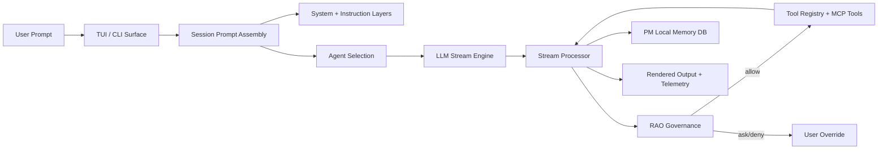
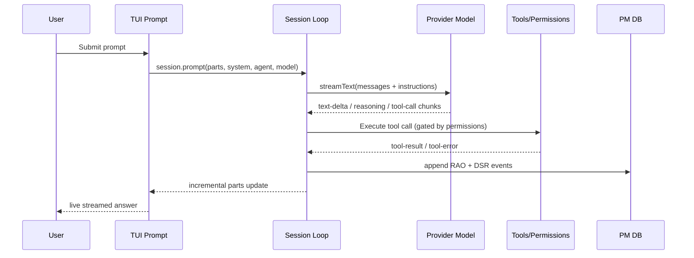
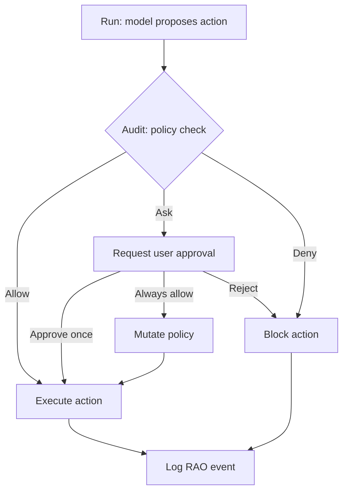
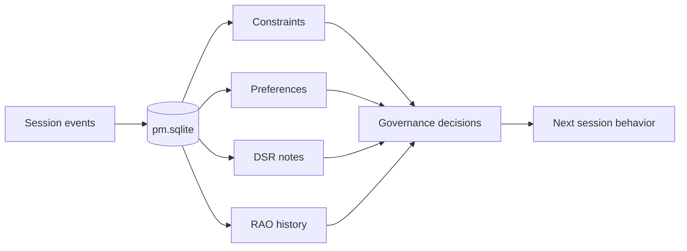

<p align="center">
  
</p>
<h1 align="center">DAX</h1>
<p align="center"><strong>Deterministic AI eXecution</strong></p>
<p align="center">A governed execution product for AI-assisted (not AI-generated) software delivery.</p>

---

## One-line definition

DAX is a deterministic execution layer that governs LLM behavior through structured policy, persistent project memory, and a Run-Audit-Override protocol.

## Why DAX exists

Most coding agents optimize for speed and output volume.
DAX optimizes for safe execution, traceability, and predictable behavior.

In DAX:

- the model suggests
- policy decides
- actions are recorded

## Core frameworks

### RAO: Run -> Audit -> Override

`Run`
The model proposes an action (plan, edit, command, migration).

`Audit`
Deterministic rules evaluate risk, scope, permissions, and constraints.

`Override`
The user can approve, reject, or persist an approval policy. Decisions are logged for replay and auditability.

### PM: Project Manager memory

PM is persistent project memory, not chat memory.

It stores:

- constraints (hard rules)
- preferences (soft behavior controls)
- RAO event history
- DSR-style notes and daily continuity context

## Product principles

- Determinism over model randomness
- Governance before execution
- Traceability over opaque autonomy
- Non-dev clarity through ELI12 explanations

## Key capabilities

- Terminal-first governed AI execution
- Provider-agnostic model integration
- Policy-aware command and file-action gating
- Persistent PM state with local memory flows
- ELI12 plain-language mode for non-technical users
- TUI workflow visibility across understanding, analysis, execution, and verification
- Core-first provider UX: OpenAI/Codex, Gemini, Anthropic, Ollama

## Default profile

DAX ships with a focused default profile to reduce noise and support overhead.

- Primary agents: `build`, `plan`, `explore`, `docs`
- Primary providers: `openai`, `google`, `anthropic`, `ollama`
- PM enabled for local persistent memory (`pm.sqlite`)
- RAO enabled for controlled execution and approvals

Advanced providers remain available, but are intentionally secondary in the default UX.

Example config to hard-enforce the focused provider set:

```json
{
  "enabled_providers": ["openai", "google", "anthropic", "ollama"]
}
```

Optional (advanced): show all providers in TUI dialogs while keeping core defaults:

```json
{
  "experimental": {
    "show_all_providers": true
  }
}
```

Ready-to-use templates:

- `examples/dax.minimal.json` (smallest core setup)
- `examples/dax.core.json` (recommended core profile)
- `examples/dax.advanced.json` (core defaults + full provider list in TUI)

## Architecture



## Workflow maps

### 1. Request-to-response stream



### 2. RAO decision path



### 3. PM memory loop



## ELI12 mode

ELI12 is a communication mode for non-technical users.

- `/eli12 on`: enable plain-language mode
- `/eli12 off`: return to normal mode
- `/eli12`: quick toggle / request simplification

ELI12 is presentation behavior, not a separate orchestration engine.
The same execution pipeline runs underneath.

## Gemini CLI auth quick check

If Google/Gemini login appears broken in TUI:

1. Run `gemini` in your terminal and complete login.
2. Verify local OAuth creds exist at `~/.gemini/oauth_creds.json`.
3. In DAX, connect provider `google` using `Use Gemini CLI login`.
4. If your creds are stored elsewhere, set:

```bash
export GEMINI_OAUTH_CREDS_PATH=/absolute/path/to/oauth_creds.json
```

## Quickstart

### Prerequisites

- Bun 1.3.x
- Git

### Install

```bash
bun install
```

### Run DAX

```bash
bun run dev
```

### Validate DAX package

```bash
bun run release:dax:verify
```

### Build DAX release artifact (CLI/TUI only)

```bash
bun run release:dax
```

Compatibility note:
- `DAX_*` env vars are primary.
- `OPENCODE_*` env aliases are supported temporarily for migration and will be removed after the first stable DAX release plus one short grace patch.

## Repository map (DAX core)

- `packages/dax/src/session` prompt assembly and streaming/session orchestration
- `packages/dax/src/cli/cmd/tui` terminal UI routes and interaction flows
- `packages/dax/src/pm` persistent PM storage and memory primitives
- `packages/dax/src/tool` tool contracts and execution boundaries
- `packages/dax/src/provider` model/provider abstraction and adapters

## What “fully moved to DAX” means

A complete migration means all of the following are true:

1. package namespaces use `@dax-ai/*` consistently
2. user-facing copy uses DAX naming and positioning
3. config/runtime paths use DAX conventions
4. plugin ecosystem and auth integrations are DAX-branded
5. legacy naming remains only in intentionally isolated compatibility zones

## Current migration work areas

- package and import namespace normalization to `@dax-ai/*`
- web/desktop/console text and links alignment to DAX branding
- legacy config/path compatibility strategy and deprecation path
- external plugin dependency rename/replacement strategy

## Safe decoupling order (recommended)

To avoid breakage, run migration in this order:

1. `docs + copy`: README/help text/provider guidance (lowest risk)
2. `dax package surfaces`: scripts, prompts, TUI labels, defaults in `packages/dax`
3. `desktop/app/web`: launcher scripts, product copy, onboarding
4. `ecosystem`: plugin/action/package names and external integrations
5. `final cleanup`: remove legacy compatibility aliases and dead paths

At the end of each batch:

1. `bun run --cwd packages/dax typecheck`
2. `bun test --cwd packages/dax`
3. `bun run --cwd packages/dax dev` (smoke launch)

If any step fails, stop and fix before moving to the next batch.

## Risk areas (plain language)

- `Lockfile/workspaces`: duplicate workspace names or stale lock entries can stop install/dev.
- `Desktop predev scripts`: old hardcoded names can still print/use legacy paths.
- `Provider matrix`: removing providers too fast can break model dialogs/tests.
- `Branding drift`: docs updated but runtime text not updated causes product confusion.
- `Large dirty worktree`: unrelated edits mixed into migration make debugging harder.

## Release readiness checklist

1. Branding: all user-facing surfaces reflect DAX language
2. Behavior: RAO and PM flows are documented and testable
3. UX: ELI12 and non-dev onboarding are coherent and low-friction
4. Quality: package-level typecheck/tests pass for release targets
5. Docs: install, run, validate, and migration notes are complete

For CLI/TUI-only release gates, use:

- `DAX_CLI_RELEASE_CHECKLIST.md`

## Positioning

DAX is not competing on “better chat.”
It competes on deterministic execution, governance, traceability, and controlled autonomy.

---

DAX: the protocol is the product.
