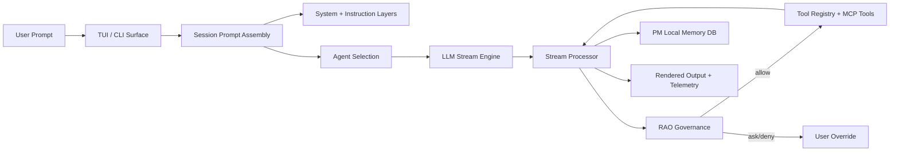

<p align="center">
  
</p>
<p align="center"><strong>DAX — Deterministic AI eXecution</strong></p>
<p align="center">Governed AI orchestration for real software delivery.</p>

---

## What DAX is

DAX is a policy-first execution product for teams that want AI speed without losing control.

Instead of a chat agent that freely edits and runs commands, DAX routes execution through a governance loop:

- Run: the model proposes
- Audit: policy evaluates risk and scope
- Override: humans approve, deny, or persist policy

This is why DAX exists: production software work needs reliability, not just fast output.

## Positioning

**DAX is not “another coding chat.”**

DAX is for:

- engineering teams that need traceable AI actions
- startups that want velocity with guardrails
- non-technical operators who need understandable execution (ELI12)

DAX is not for:

- users who only want a lightweight conversational coding toy
- workflows where governance and auditability do not matter

## Product pillars

### 1. RAO (Run -> Audit -> Override)

Every sensitive action can be policy-gated.

- explicit allow / ask / deny rules
- persisted approval decisions
- deterministic execution boundaries

### 2. PM (Project Memory)

PM is persistent operational memory, not ephemeral chat context.

- constraints and preferences
- notes and continuity
- replayable context for future sessions

### 3. Orchestration-first UX

DAX is optimized for natural language programming with visible control surfaces:

- RAO state and pending approvals
- PM access in-session
- Pane modes for Artifact / Diff / RAO / PM

## Why teams choose DAX

- **Determinism over model randomness**
- **Governance over blind autonomy**
- **Traceability over black-box behavior**
- **Execution quality over output quantity**

## Core capabilities

- Terminal-native AI orchestration
- Multi-provider model support (OpenAI, Google, Anthropic, Ollama)
- Tool and command governance with explicit permissions
- Persistent PM memory (`pm.sqlite`)
- ELI12 communication mode for non-technical users
- Session pane for operational visibility (`artifact`, `diff`, `rao`, `pm`)

## UX profile

DAX ships with a focused default profile:

- primary agents: `build`, `plan`, `explore`, `docs`
- primary providers: `openai`, `google`, `anthropic`, `ollama`
- RAO enabled by default
- PM enabled by default

Example:

```json
{
  "enabled_providers": ["openai", "google", "anthropic", "ollama"]
}
```

## Quickstart

### Prerequisites

- Bun 1.3.x
- Git

### Install

```bash
bun install
```

### Run

```bash
bun run dev
```

### Verify package quality

```bash
bun run release:dax:verify
```

### Build release artifacts

```bash
bun run release:dax
```

## Gemini CLI auth (recommended)

If Gemini provider auth appears broken:

1. Run `gemini` in your terminal and complete login.
2. Verify `~/.gemini/oauth_creds.json` exists.
3. In DAX, connect provider `google` with `Use Gemini CLI login`.
4. If credentials are elsewhere:

```bash
export GEMINI_OAUTH_CREDS_PATH=/absolute/path/to/oauth_creds.json
```

Direct email OAuth is maintainer-only and shown only when all are set:

```bash
export DAX_GEMINI_EMAIL_AUTH=1
export DAX_GEMINI_OAUTH_CLIENT_ID=...
export DAX_GEMINI_OAUTH_CLIENT_SECRET=...
```

## Visual system and productivity defaults

DAX now uses a governance-centric visual hierarchy:

- high-contrast operational palette
- RAO/PM/Pane state visibility in-session
- reduced command noise in slash UX

For best readability/productivity in terminal UIs, use a coding font in your terminal profile:

- `JetBrains Mono`
- `Berkeley Mono`
- `IBM Plex Mono`
- `Monaspace Argon`

Recommended terminal settings:

- font size: 13-15
- line height: 1.15-1.3
- enable ligatures only if they improve readability for your team

## Architecture (unchanged)



---

DAX is designed for teams that want AI to be powerful, governable, and production-safe.
