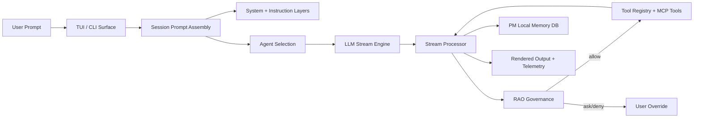

<p align="center">
  
</p>
<p align="center"><strong>DAX — Deterministic AI eXecution</strong></p>
<p align="center">Governed AI orchestration for real software delivery.</p>

---

## Overview

DAX is a policy-first AI execution product.

It is built for teams that want AI speed, but require control, auditability, and predictable behavior in production workflows.

Instead of a free-running coding chat, DAX uses RAO:

- Run: model proposes action
- Audit: policy evaluates risk and scope
- Override: user approves, denies, or persists decisions

## Who DAX is for

DAX is a good fit for:

- engineering teams that need traceable AI actions
- startups that want fast iteration with guardrails
- mixed technical/non-technical teams using ELI12 mode

DAX is not optimized for:

- chat-only experimentation with no governance requirements
- workflows where auditability and policy do not matter

## Core capabilities

- Terminal-native AI orchestration
- Multi-provider support: OpenAI, Google, Anthropic, Ollama
- RAO policy gating with allow/ask/deny decisions
- Persistent project memory (PM) in `pm.sqlite`
- ELI12 mode for plain-language explanations
- Session pane surfaces: `artifact`, `diff`, `rao`, `pm`
- Theme system with multiple built-in themes and quick switching

## Product pillars

### RAO (Run -> Audit -> Override)

- Explicit permissions for sensitive actions
- Persistent approval choices when desired
- Human override for critical operations

### PM (Project Memory)

- Persistent constraints/preferences/notes
- Session continuity across runs
- Operational memory separate from transient chat context

### Orchestration-first UX

- Operational visibility in-session (status, stage, pane)
- Approval UX for risky actions
- Natural language programming focus with reduced command clutter

## Quickstart

### Prerequisites

- Bun `1.3.x`
- Git

### Install

```bash
bun install
```

### Run DAX

```bash
bun run dev
```

### Validate quality locally

```bash
bun run typecheck:dax
bun run test:dax
```

### Full release verification pipeline

```bash
bun run release:dax:verify
```

### Build release artifacts

```bash
bun run release:dax
```

## Configuration snapshot

DAX uses project/global config with provider and policy controls.

Example:

```json
{
  "enabled_providers": ["openai", "google", "anthropic", "ollama"]
}
```

Default UX profile is tuned for orchestration:

- primary agents: `build`, `plan`, `explore`, `docs`
- RAO enabled by default
- PM enabled by default

## Gemini auth

Recommended: Gemini CLI token reuse.

1. Run `gemini` and complete login.
2. Verify `~/.gemini/oauth_creds.json` exists.
3. In DAX, connect `google` provider and select Gemini CLI login.
4. If your creds file is elsewhere:

```bash
export GEMINI_OAUTH_CREDS_PATH=/absolute/path/to/oauth_creds.json
```

Email OAuth is maintainer-only and requires:

```bash
export DAX_GEMINI_EMAIL_AUTH=1
export DAX_GEMINI_OAUTH_CLIENT_ID=...
export DAX_GEMINI_OAUTH_CLIENT_SECRET=...
```

## UX and readability defaults

Recommended terminal setup:

- font size: `13-15`
- line height: `1.15-1.3`
- high-contrast theme for long sessions

Suggested fonts:

- default recommendation: `JetBrains Mono`
- `Berkeley Mono`
- `IBM Plex Mono`
- `Monaspace Argon`

## Security and governance notes

- Sensitive actions are designed to pass through RAO checks.
- External-directory and risky command paths are permission-gated.
- Policy profile can be tuned (balanced/strict) for stronger approvals.

## Architecture



## Maintainer pre-release checklist

Use this before any public tag/cut:

1. `bun install`
2. `bun run typecheck:dax`
3. `bun run test:dax`
4. `bun run release:dax:verify`
5. `bun run release:dax`
6. Smoke test TUI on narrow and wide terminal sizes
7. Verify provider login flows (especially Google/Gemini)
8. Verify RAO approval paths and policy profile behavior

---

DAX is built for teams that need AI to be fast, governable, and production-safe.
