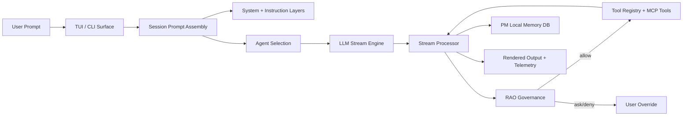
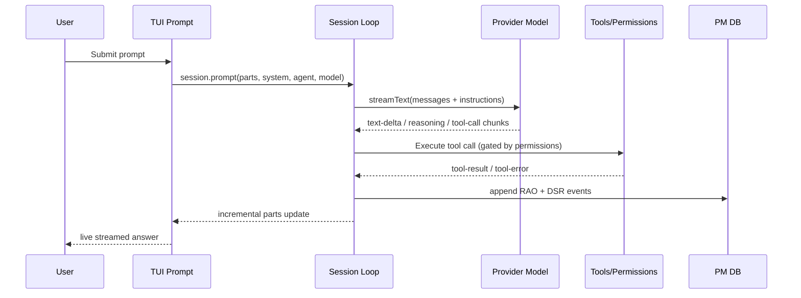
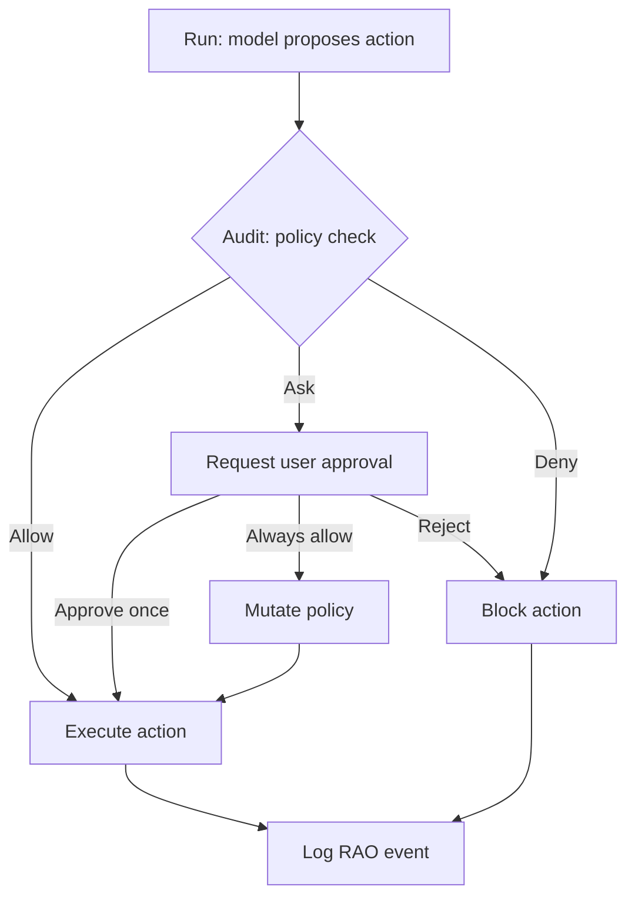
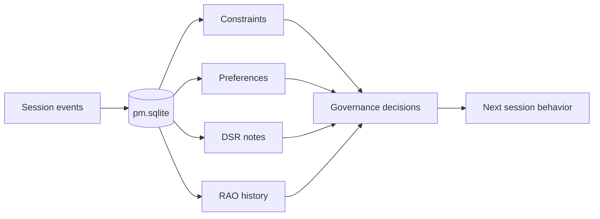

<p align="center">
  
</p>
<pre align="center">
██████╗  █████╗ ██╗  ██╗     ██████╗ ██╗     ██╗
██╔══██╗██╔══██╗╚██╗██╔╝    ██╔════╝ ██║     ██║
██║  ██║███████║ ╚███╔╝     ██║      ██║     ██║
██║  ██║██╔══██║ ██╔██╗     ██║      ██║     ██║
██████╔╝██║  ██║██╔╝ ██╗    ╚██████╗ ███████╗██║
╚═════╝ ╚═╝  ╚═╝╚═╝  ╚═╝     ╚═════╝ ╚══════╝╚═╝
</pre>
<p align="center"><strong>Deterministic AI eXecution</strong></p>
<p align="center">A governed execution product for AI-assisted (not AI-generated) software delivery.</p>

---

## One-line definition

DAX is a deterministic execution layer that governs LLM behavior through structured policy, persistent project memory, and a Run-Audit-Override protocol.

## Why DAX exists

Most coding agents optimize for speed and output volume.
DAX optimizes for safe execution, traceability, and predictable behavior.

In DAX:

- the model suggests
- policy decides
- actions are recorded

## Core frameworks

### RAO: Run -> Audit -> Override

`Run`
The model proposes an action (plan, edit, command, migration).

`Audit`
Deterministic rules evaluate risk, scope, permissions, and constraints.

`Override`
The user can approve, reject, or persist an approval policy. Decisions are logged for replay and auditability.

### PM: Project Manager memory

PM is persistent project memory, not chat memory.

It stores:

- constraints (hard rules)
- preferences (soft behavior controls)
- RAO event history
- DSR-style notes and daily continuity context

## Product principles

- Determinism over model randomness
- Governance before execution
- Traceability over opaque autonomy
- Non-dev clarity through ELI12 explanations

## Key capabilities

- Terminal-first governed AI execution
- Provider-agnostic model integration
- Policy-aware command and file-action gating
- Persistent PM state with local memory flows
- ELI12 plain-language mode for non-technical users
- TUI workflow visibility across understanding, analysis, execution, and verification
- Core-first provider UX: OpenAI/Codex, Gemini, Anthropic, Ollama

## Default profile

DAX ships with a focused default profile to reduce noise and support overhead.

- Primary agents: `build`, `plan`, `explore`, `docs`
- Primary providers: `openai`, `google`, `anthropic`, `ollama`
- PM enabled for local persistent memory (`pm.sqlite`)
- RAO enabled for controlled execution and approvals

Advanced providers remain available, but are intentionally secondary in the default UX.

Example config to hard-enforce the focused provider set:

```json
{
  "enabled_providers": ["openai", "google", "anthropic", "ollama"]
}
```

Optional (advanced): show all providers in TUI dialogs while keeping core defaults:

```json
{
  "experimental": {
    "show_all_providers": true
  }
}
```

Ready-to-use templates:

- `examples/dax.minimal.json` (smallest core setup)
- `examples/dax.core.json` (recommended core profile)
- `examples/dax.advanced.json` (core defaults + full provider list in TUI)

## Architecture



## Workflow maps

### 1. Request-to-response stream



### 2. RAO decision path



### 3. PM memory loop



## ELI12 mode

ELI12 is a communication mode for non-technical users.

- `/eli12 on`: enable plain-language mode
- `/eli12 off`: return to normal mode
- `/eli12`: quick toggle / request simplification

ELI12 is presentation behavior, not a separate orchestration engine.
The same execution pipeline runs underneath.

## Gemini CLI auth quick check

If Google/Gemini login appears broken in TUI:

1. Run `gemini` in your terminal and complete login.
2. Verify local OAuth creds exist at `~/.gemini/oauth_creds.json`.
3. In DAX, connect provider `google` using `Use Gemini CLI login`.
4. If your creds are stored elsewhere, set:

```bash
export GEMINI_OAUTH_CREDS_PATH=/absolute/path/to/oauth_creds.json
```

Direct email OAuth (`Sign in with Google (email)`) is an optional maintainer mode.
It is shown only when all of these are set:

```bash
export DAX_GEMINI_EMAIL_AUTH=1
export DAX_GEMINI_OAUTH_CLIENT_ID=...
export DAX_GEMINI_OAUTH_CLIENT_SECRET=...
```

For end users, the supported zero-setup path is `Use Gemini CLI login (import)`.

## Quickstart

### Prerequisites

- Bun 1.3.x
- Git

### Install

```bash
bun install
```

### Run DAX

```bash
bun run dev
```

### Validate DAX package

```bash
bun run release:dax:verify
```

### Build DAX release artifact (CLI/TUI only)

```bash
bun run release:dax
```

Environment note:

- Use `DAX_*` environment variables.

## Positioning

An AI Agent designed for Governance, not just Speed.

DAX is not competing on “better chat.”
It competes on deterministic execution, governance, traceability, and controlled autonomy.

---

DAX: the protocol is the product.

## CLI Startup Banner

To display the DAX banner with the brand gradient on startup:

```typescript
import { readFile } from "node:fs/promises"
import { join } from "node:path"
import gradient from "gradient-string"

async function showBanner() {
  const bannerPath = join(process.cwd(), "assets", "banner.txt")
  const banner = await readFile(bannerPath, "utf-8")

  // DAX Brand Gradient (Blue to Purple)
  const daxGradient = gradient(["#3b82f6", "#8b5cf6"])
  console.log(daxGradient.multiline(banner))
}
```

## License

This project is open source and available under the [MIT License](LICENSE).
