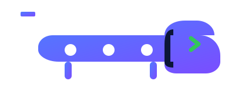

<p align="center">
  <br>
  
  <br>
  
  <br>
  <b>Deterministic AI eXecution</b>
  <br>
  <i>The execution control plane for AI-assisted SDLC.</i>
</p>

<p align="center">
  <a href="https://github.com/ShaileshRawat1403/dax-tui/actions/workflows/ci.yml">
    
  </a>
  <a href="https://github.com/ShaileshRawat1403/dax-tui/releases">
    
  </a>
  <a href="./LICENSE">
    
  </a>
  <a href="https://bun.sh">
    
  </a>
  <a href="https://github.com/ShaileshRawat1403/dax-tui">
    
  </a>
</p>

---

## 🚀 Overview

**DAX** is a professional-grade execution control plane designed for engineering teams and ambitious builders. While standard AI chat interfaces are built for conversation, DAX is built for **delivery**. It provides explicit control, traceability, and governance over AI operations within your software development lifecycle.

The flagship experience is a **transcript-first terminal workstation** that treats AI reasoning and tool execution as a verifiable audit trail rather than a black box.

### ⚖️ The RAO Governance Loop

DAX replaces free-running autonomy with the **RAO** (Run-Audit-Override) model:

1.  **Run**: The model proposes a technical action or plan.
2.  **Audit**: Automated permission rules and safety gates evaluate the action.
3.  **Override**: Human operators review, allow, or persist decisions via high-fidelity TUI surfaces.

---

## ✨ Core Capabilities

- **Governed Workstation**: A dual-surface TUI with a narrative execution stream and a dedicated control pane for changes, audits, and approvals.
- **Multi-Provider Substrate**: Seamless integration with OpenAI, Google Gemini, Anthropic, Ollama, and custom MCP servers.
- **Project Memory (PM)**: Durable, cross-session operational memory stored in a local SQLite engine.
- **ELI12 Mode**: Real-time response translation for non-technical stakeholders without losing technical precision.
- **Professional Tooling**:
  - `dax explore`: Structured repository analysis and shape detection.
  - `dax audit`: Real-time trust posture assessment.
  - `dax verify`: Evidence-based session validation.
  - `dax plan`: Inspect and refine task graphs before execution.

---

## 📖 Documentation Index

| Category              | Guides                                                                                                                                                                                                                                             |
| :-------------------- | :------------------------------------------------------------------------------------------------------------------------------------------------------------------------------------------------------------------------------------------------- |
| **Getting Started**   | [What Is DAX?](./docs/product/WHAT_IS_DAX.md) • [In Simple Words](./docs/product/DAX_IN_SIMPLE_WORDS.md) • [Quickstart](./docs/product/QUICKSTART.md) • [Start Here](./docs/product/start-here.md) • [Provider Setup](./docs/product/providers.md) |
| **Product & Use**     | [Runs, Approvals & Recovery](./docs/product/RUNS_APPROVALS_AND_RECOVERY.md) • [Workflows](./docs/product/WORKFLOWS.md) • [Audit Agent](./docs/product/audit-agent.md) • [Build on DAX](./docs/product/build-on-dax.md)                             |
| **Architecture**      | [How DAX Works](./docs/architecture/HOW_DAX_WORKS.md) • [Full Architecture](./docs/architecture/ARCHITECTURE.md) • [Trust Model](./docs/architecture/DAX_TRUST_MODEL.md) • [Execution Model](./docs/architecture/DAX_EXECUTION_MODEL.md)           |
| **Open Source Stack** | [Stack Roadmap](./docs/OPEN_SOURCE_STACK_ROADMAP.md) • [Deployment Guide](./docs/OPEN_SOURCE_STACK_DEPLOYMENT.md)                                                                                                                                  |
| **Trust**             | [Transparency & Limitations](./docs/product/TRANSPARENCY_AND_LIMITATIONS.md) • [Write Governance](./docs/features/DAX_WRITE_GOVERNANCE.md) • [Release Readiness](./docs/product/release-readiness.md) • [Security Policy](./SECURITY.md)           |

---

## 🛠️ Installation

### 🍎 macOS & 🐧 Linux

The recommended way to install the DAX binary is via the universal installation script:

```bash
# Install the latest version
curl -fsSL https://raw.githubusercontent.com/ShaileshRawat1403/dax-tui/main/script/install.sh | bash
```

### 🍺 macOS & 🐧 Linux via Homebrew

If you prefer Homebrew, DAX is also available from the public tap:

```bash
brew install ShaileshRawat1403/tap/dax
```

### 🪟 Windows

You can install DAX using **WinGet**:

```powershell
winget install DaxAi.DAX
```

### 🌿 Local Development

If you are contributing to this repository, you can link your local version globally:

```bash
bun install
cd packages/dax
bun link
```

### Verification

After installation, verify it works by running:

```bash
dax --version
```

### Google / Gemini auth note

For most users, DAX will show three Google auth options:

- `Gemini API Key`
- `Gemini Subscription Sign-In`
- `Custom Google OAuth Client`

`Gemini Subscription Sign-In` uses your local `gemini` CLI session when available, and falls back to direct browser sign-in when `DAX_GOOGLE_CLI_CLIENT_ID` and `DAX_GOOGLE_CLI_CLIENT_SECRET` are configured.

### If You’re Not a Developer

Start with [DAX in Simple Words](./docs/product/DAX_IN_SIMPLE_WORDS.md) and the new [Non-Developer Guide](./docs/product/NON_DEVELOPERS.md).

Those guides explain:

- what DAX actually does in plain English
- which model setup is easiest
- what to expect when DAX pauses for approval
- what common messages like rate limits or re-auth prompts mean

---

## 🏗️ Workspace Integration

DAX is part of a larger ecosystem designed for enterprise-grade AI orchestration:

- **`dax`**: The local-first execution authority and developer workstation.
- **`soothsayer`**: The multi-user web platform for centralized governance and observation.
- **`workspace-mcp`**: The shared policy and capability kernel.
- **`picobot`**: Thin ingress for multi-channel (Telegram, WhatsApp, etc.) via `repo_analyze` and `draft_and_approve` workflows.

### Open Source Stack

DAX ships with a production-ready integration layer for external consumers:

| Component          | Purpose                                                                                      |
| ------------------ | -------------------------------------------------------------------------------------------- |
| **FastMCP**        | External API substrate — 7 governed tools (run.create/get, approvals, recovery) on port 4730 |
| **GitHub Actions** | `dax-analyze` composite action for PR-gated repo analysis                                    |
| **NATS/JetStream** | Event bus for run lifecycle, approvals, and recovery fan-out                                 |
| **Infisical**      | Secrets management — credentials fetched at startup, graceful fallback to env vars           |
| **ZITADEL**        | Identity and JWT auth — actor claims propagated through FastMCP calls                        |
| **OpenTelemetry**  | Traces and metrics export via OTLP HTTP                                                      |

See the [Stack Roadmap](./docs/OPEN_SOURCE_STACK_ROADMAP.md) and [Deployment Guide](./docs/OPEN_SOURCE_STACK_DEPLOYMENT.md) for full details.

---

## 🛠️ Quickstart

### Prerequisites

- [Bun](https://bun.sh) `1.3.x`
- Git

### Installation

```bash
git clone https://github.com/ShaileshRawat1403/dax-tui.git
cd dax-tui
bun install
```

### Usage

```bash
# Start the interactive workstation
bun run dev

# Run a quality check
bun run test
```

---

## ⚠️ Disclaimer & Safety

**DAX is professional software for governed AI execution.**

- **HITL Required**: Always review critical actions. DAX is an assistant, not a replacement for engineering judgment.
- **Data Privacy**: All session data and API keys are stored locally unless explicitly integrated with a remote provider.
- **Model Accuracy**: Results depend on the underlying LLM. Verify all generated code and configurations.

---

## 🤝 Contributing

We welcome contributions! Please see our [Contributing Guide](./CONTRIBUTING.md) for standards and setup instructions.

## 📄 License

Distributed under the MIT License. See `LICENSE` for more information.
