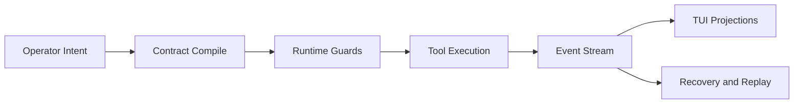
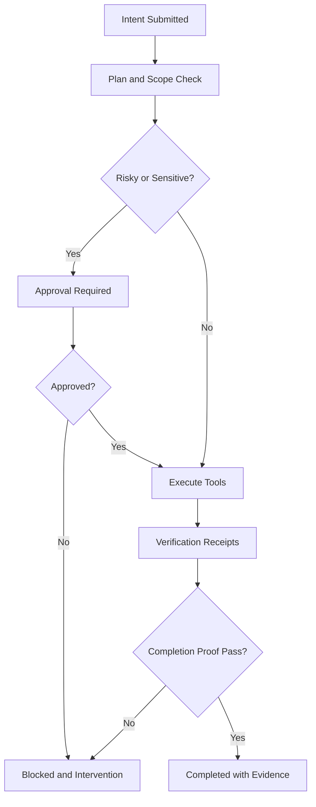
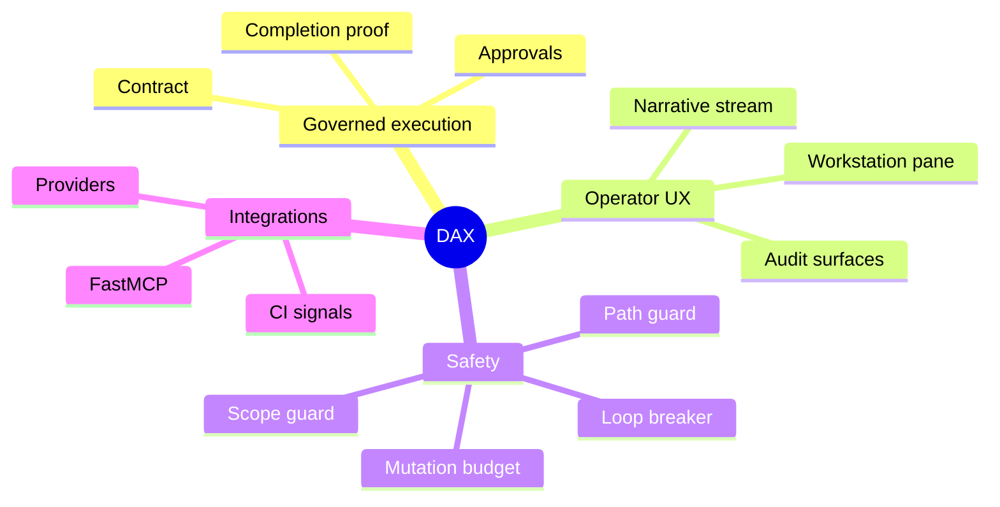

<p align="center">
  <br>
  
  <br>
  
  <br>
  <b>Deterministic runtime contract around stochastic model execution</b>
  <br>
  <i>The execution control plane for AI-assisted SDLC.</i>
</p>

<p align="center">
  <a href="https://github.com/ShaileshRawat1403/dax/actions/workflows/ci.yml">
    
  </a>
  <a href="https://github.com/ShaileshRawat1403/dax/releases/latest">
    
  </a>
  <a href="./LICENSE">
    
  </a>
  <a href="https://bun.sh">
    
  </a>
  <a href="https://github.com/ShaileshRawat1403/dax">
    
  </a>
</p>

---

## Overview

**DAX** is a **projection-first governed execution workstation** designed for engineering teams and ambitious builders. Driven by a canonical event language, DAX treats AI reasoning and tool execution as a verifiable audit trail rather than a black box.

Its core claim is intentionally narrow: DAX provides a **deterministic runtime contract around stochastic model execution**, not a promise that model outputs themselves will be identical across runs.

While standard AI chat interfaces are built for conversation, DAX is built for **delivery**. It provides explicit control, traceability, and governance over AI operations within your software development lifecycle.

### One-Line Positioning

**DAX is the governed execution workstation for AI-driven software work, giving teams approvals, replayability, and audit-grade control instead of black-box agent behavior.**

## System Maps

### Architecture map


```mermaid
graph LR
  U[Operator Intent] --> C[Contract Compile]
  C --> G[Runtime Guards]
  G --> T[Tool Execution]
  T --> E[Event Stream]
  E --> P[TUI Projections]
  E --> R[Recovery and Replay]
```

### Execution workflow


```mermaid
flowchart TD
  A[Intent Submitted] --> B[Plan and Scope Check]
  B --> C{Risky or Sensitive?}
  C -- Yes --> D[Approval Required]
  D --> E{Approved?}
  E -- No --> X[Blocked and Intervention]
  E -- Yes --> F[Execute Tools]
  C -- No --> F
  F --> G[Verification Receipts]
  G --> H{Completion Proof Pass?}
  H -- No --> X
  H -- Yes --> I[Completed with Evidence]
```

### Product mindmap


```mermaid
mindmap
  root((DAX))
    Governed execution
      Contract
      Approvals
      Completion proof
    Operator UX
      Narrative stream
      Workstation pane
      Audit surfaces
    Safety
      Scope guard
      Path guard
      Mutation budget
      Loop breaker
    Integrations
      Providers
      FastMCP
      CI signals
```

### Rust Proof Ladder

DAX's runtime contract is made testable by deterministic Rust proof crates:

| Crate | Proves |
| ----- | ------ |
| `dax-core` | What happened — replays the canonical event log to reconstruct run state |
| `dax-policy` | Whether an action should proceed — evaluates tool requests against policy with no model call |
| `dax-audit` | Whether a run is trustworthy — derives trust posture from six structured checks |
| `dax-ledger` | Whether an event chain is intact — verifies append-only tamper evidence |

The model output remains stochastic. The runtime layer around it does not.

> DAX uses Rust for deterministic replay, policy evaluation, and audit proof surfaces around stochastic model execution.

Each crate calls through a JSON stdio boundary from TypeScript. See [Rust Proof Ladder](./docs/architecture/RUST_PROOF_LADDER.md) for the full breakdown.

To run the core proof ladder end to end against a synthetic session:

```bash
bun run demo:proof-ladder
```

### The RAO Governance Loop

DAX replaces free-running autonomy with the **RAO** (Run-Audit-Override) model:

1.  **Run**: The model proposes a technical action or plan.
2.  **Audit**: Automated permission rules and safety gates evaluate the action.
3.  **Override**: Human operators review, allow, or persist decisions via high-fidelity TUI surfaces.

---

## Core Capabilities

- **Governed Workstation**: A dual-surface TUI with a narrative execution stream and a dedicated control pane for changes, audits, and approvals.
- **Multi-Provider Substrate**: Seamless integration with OpenAI, Google Gemini, Anthropic, Ollama, and custom MCP servers.
- **Built-In Skills**: Ships first-party workflow skills such as `repo-explore`, `git-review`, `release-readiness`, and `artifact-audit`.
- **Project Memory (PM)**: Durable, cross-session operational memory stored in a local SQLite engine.
- **Governed External Workers**: Run Claude Code, Codex CLI, or Gemini CLI in a disposable checkout while DAX owns scope enforcement, verification, evidence, and approval.
- **ELI12 Mode**: Real-time response translation for non-technical stakeholders without losing technical precision.
- **Professional Tooling**:
  - `dax explore`: Structured repository analysis and shape detection.
  - `dax audit`: Real-time trust posture assessment.
  - `dax verify`: Evidence-based session validation.
  - `dax plan`: Inspect and refine task graphs before execution.
  - `dax worker run`: Govern an external coding agent instead of trusting its self-report.

### Govern an external coding agent

```bash
dax doctor
dax worker run codex --write-scope "src/**" --forbid package.json --verify "bun test" -- \
  "add an isEven helper with tests"
```

DAX shows the exact contract before launch, runs the worker in a disposable
checkout, computes the Git diff itself, executes verification without network,
and pauses for a human decision. Governed external workers require macOS
Seatbelt or Linux bubblewrap; Windows support is not included in the v1.2 beta.

Supported worker IDs are `claude`, `codex`, `antigravity`, and the legacy
`gemini` lane for supported enterprise/API-key Gemini CLI deployments. For an
individual Google AI subscription, install and authenticate Google's `agy`
CLI, then run `dax worker run antigravity -- "<task>"`. DAX invokes AGY inside
the same governed checkout, egress, verification, evidence, and approval
boundaries as every other external worker.

In the TUI, use `/workers` (or `/agy`) to launch the same governed flow. The
`/connect` dialog also links to Antigravity under **Governed worker**. AGY does
not appear in `/models` because it is an execution worker, not a direct model
provider.

## How DAX Differs

DAX is not trying to be the fastest “AI coding assistant” in an editor tab. It is trying to be the most trustworthy execution system when the work actually matters.

| Tool | Core mental model | Strength | Where DAX is different |
| :--- | :--- | :--- | :--- |
| **Cursor** | AI-native coding IDE | Fast in-editor generation and editing | DAX centers approvals, replay, audit trail, and governed execution instead of IDE convenience |
| **Codex** | Strong agentic coding runtime | High implementation throughput and coding depth | DAX treats the run as the product, with explicit intervention and approval objects |
| **Claude Code** | Terminal-native coding agent | Strong repo reasoning and CLI flow | DAX is more operator-first, with canonical run state, speculative previews, and recovery surfaces |
| **DAX** | Governed execution workstation | Control plane for AI work in real repositories | Purpose-built for traceability, approval-aware operations, and reviewable delivery |

### What DAX Should Win On

- clear pause and approval semantics
- evidence-forward diffs before mutation
- replayable run state instead of chat archaeology
- trust, audit, and release-readiness workflows
- local operator memory that improves continuity without pretending to be magic

---

## Documentation Index

| Category              | Guides                                                                                                                                                                                                                                             |
| :-------------------- | :------------------------------------------------------------------------------------------------------------------------------------------------------------------------------------------------------------------------------------------------- |
| **Getting Started**   | [What Is DAX?](./docs/product/WHAT_IS_DAX.md) • [In Simple Words](./docs/product/DAX_IN_SIMPLE_WORDS.md) • [Quickstart](./docs/product/QUICKSTART.md) • [Start Here](./docs/product/start-here.md) • [Provider Setup](./docs/product/providers.md) |
| **Product & Use**     | [User Guide](./docs/product/USER_GUIDE.md) • [Intent Guide](./docs/product/INTENT_GUIDE.md) • [Tool & Risk Matrix](./docs/product/TOOLS_AND_RISK_MATRIX.md) • [Runs, Approvals & Recovery](./docs/product/RUNS_APPROVALS_AND_RECOVERY.md) • [Workflows](./docs/product/WORKFLOWS.md) • [Positioning](./docs/product/POSITIONING.md) • [Roadmap](./docs/product/ROADMAP.md) |
| **Architecture**      | [How DAX Works](./docs/architecture/HOW_DAX_WORKS.md) • [Full Architecture](./docs/architecture/ARCHITECTURE.md) • [Trust Model](./docs/architecture/DAX_TRUST_MODEL.md) • [Execution Model](./docs/architecture/DAX_EXECUTION_MODEL.md) • [Rust Proof Ladder](./docs/architecture/RUST_PROOF_LADDER.md) • [DAX Evals](./docs/architecture/DAX_EVALS.md) • [Stack Operating Model](./docs/STACK_OPERATING_MODEL.md) |
| **Open Source Stack** | [Stack Roadmap](./docs/OPEN_SOURCE_STACK_ROADMAP.md) • [Deployment Guide](./docs/OPEN_SOURCE_STACK_DEPLOYMENT.md)                                                                                                                                  |
| **Governance**        | [Policy Tuning](./docs/product/POLICY_TUNING.md) • [Project Memory](./docs/product/PROJECT_MEMORY.md) • [Transparency & Limitations](./docs/product/TRANSPARENCY_AND_LIMITATIONS.md) • [Write Governance](./docs/features/DAX_WRITE_GOVERNANCE.md) |
| **Context**           | [Builder's Note](./docs/BUILDERS_NOTE.md) • [Non-Developer Guide](./docs/product/NON_DEVELOPERS.md)                                                                                                                                               |

---

## Installation

### macOS and Linux

The recommended way to install the DAX binary is via the universal installation script:

```bash
# Install the latest version
curl -fsSL https://raw.githubusercontent.com/ShaileshRawat1403/dax/main/script/install.sh | DAX_REPO=ShaileshRawat1403/dax bash
```

### macOS and Linux via Homebrew

If you prefer Homebrew, DAX is also available from the public tap:

```bash
brew install ShaileshRawat1403/tap/dax
```

### Windows

You can install DAX using **WinGet**:

```powershell
winget install DaxAi.DAX
```

### Local Development

If you are contributing to this repository, you can link your local version globally:

```bash
bun install
cd packages/dax
bun link
```

### Verification

After installation, verify it works by running:

```bash
dax --version
```

### Google / Gemini auth note

By default, DAX shows two direct Google provider auth options:

- `Gemini API Key`
- `Google OAuth Client Sign-In`

Google [ended consumer Gemini CLI service](https://developers.google.com/gemini-code-assist/docs/deprecations/code-assist-individuals)
on June 18, 2026. Individual Google
AI subscription users should use the governed Antigravity worker instead of
importing `gemini` CLI credentials. The old import remains available only for
supported enterprise/Google Cloud deployments when
`DAX_ENABLE_LEGACY_GEMINI_CLI_IMPORT=1` is set.

`Google OAuth Client Sign-In` is the browser-based lane. If `DAX_GOOGLE_CLI_CLIENT_ID` and `DAX_GOOGLE_CLI_CLIENT_SECRET` are configured, DAX can use them directly. Otherwise it will prompt for your own OAuth client credentials.

If you inspect the source, you may also see more specific internal Gemini method names. Those are implementation details, not extra user-facing choices.

Authentication is local to your machine and OS user account. DAX does not ship someone else's subscriptions to other users. If a new user installs DAX on their own machine, they authenticate with their own account, keys, OAuth client, or local AGY login.

### Anthropic / Claude Pro-Max note

Anthropic recently moved third-party app usage onto its extra-usage policy for some Pro/Max flows. If DAX says your Anthropic lane is connected but Claude still behaves differently than it did yesterday, check your Anthropic usage page before blaming local auth. Or, in slightly more builder-native language: apparently the open ecosystem now comes with a velvet rope and a cover charge.

### If You’re Not a Developer

Start with [DAX in Simple Words](./docs/product/DAX_IN_SIMPLE_WORDS.md) and the new [Non-Developer Guide](./docs/product/NON_DEVELOPERS.md).

Those guides explain:

- what DAX actually does in plain English
- which model setup is easiest
- what to expect when DAX pauses for approval
- what common messages like rate limits or re-auth prompts mean

## Builder's Note

DAX is not just a codebase. It is an attempt to make AI systems feel less like improv and more like operations.

It was built from a systems-thinking, orchestration, and technical-communication perspective, with AI-assisted development as part of the method rather than something quietly hidden in the basement. If you want the fuller context behind the project, read the [Builder's Note](./docs/BUILDERS_NOTE.md).

---

## Workspace Integration

DAX is part of a larger ecosystem designed for enterprise-grade AI orchestration:

- **`dax`**: The local-first execution authority and developer workstation.
- **`soothsayer`**: The multi-user web platform for centralized governance and observation.
- **`workspace-mcp`**: The shared policy and capability kernel.
- **`picobot`**: Thin ingress for multi-channel (Telegram, WhatsApp, etc.) via `repo_analyze` and `draft_and_approve` workflows.

If you are working across multiple repos in this stack, read the [Stack Operating Model](./docs/STACK_OPERATING_MODEL.md) first. It defines the non-drift rules and the intended product hierarchy across DAX, Picobot, and Soothsayer.

### Open Source Stack

DAX ships with a production-ready integration layer for external consumers:

| Component          | Purpose                                                                                      |
| ------------------ | -------------------------------------------------------------------------------------------- |
| **FastMCP**        | External API substrate — 7 governed tools (run.create/get, approvals, recovery) on port 4730 |
| **GitHub Actions** | `dax-analyze` composite action for PR-gated repo analysis                                    |
| **NATS/JetStream** | Event bus for run lifecycle, approvals, and recovery fan-out                                 |
| **Infisical**      | Secrets management — credentials fetched at startup, graceful fallback to env vars           |
| **ZITADEL**        | Identity and JWT auth — actor claims propagated through FastMCP calls                        |
| **OpenTelemetry**  | Traces and metrics export via OTLP HTTP                                                      |

See the [Stack Roadmap](./docs/OPEN_SOURCE_STACK_ROADMAP.md) and [Deployment Guide](./docs/OPEN_SOURCE_STACK_DEPLOYMENT.md) for full details.

---

## Quickstart

### Prerequisites

- [Bun](https://bun.sh) `1.3.x`
- Git

### Installation

```bash
git clone https://github.com/ShaileshRawat1403/dax.git
cd dax
bun install
```

### Usage

```bash
# Start the interactive workstation
bun run dev

# Run a quality check
bun run test

# Run the Rust proof ladder end to end (no credentials required)
bun run demo:proof-ladder
```

---

## Disclaimer & Safety

**DAX is professional software for governed AI execution.**

- **HITL Required**: Always review critical actions. DAX is an assistant, not a replacement for engineering judgment.
- **Data Privacy**: All session data and API keys are stored locally unless explicitly integrated with a remote provider.
- **Model Accuracy**: Results depend on the underlying LLM. Verify all generated code and configurations.

---

## Contributing

We welcome contributions! Please see our [Contributing Guide](./CONTRIBUTING.md) for standards and setup instructions.

If DAX is useful to you, fork it, explore it, and open a PR. Great contributions are not limited to code. Clearer docs, safer workflows, better onboarding, better approvals UX, and sharper trust/governance surfaces all move the project forward.

## License

Distributed under the MIT License. See `LICENSE` for more information.
