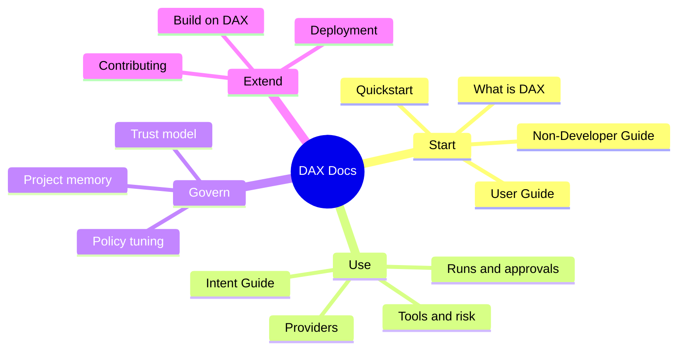
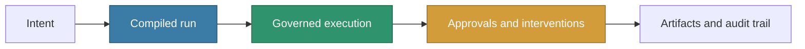

# DAX Documentation Portal

Welcome to the canonical documentation for **DAX**, the governed execution workstation built around a deterministic runtime contract for stochastic model execution. This portal is designed to provide clear guidance for users, contributors, and architects.

This index is release-facing. Internal planning and maintainer-only notes are intentionally excluded from the links below.

---

## Start Here

If you are new to DAX, start here to understand the core concepts and get your environment ready.

- [**What Is DAX?**](./product/WHAT_IS_DAX.md) - What DAX is, what problem it solves, and who it's for.
- [**Stack Operating Model**](./STACK_OPERATING_MODEL.md) - Canonical cross-repo context for DAX, Picobot, and Soothsayer.
- [**DAX In Simple Words**](./product/DAX_IN_SIMPLE_WORDS.md) - Analogies and plain-language walkthrough (ELI12).
- [**Quickstart**](./product/QUICKSTART.md) - Install, configure, and run your first workflow in 5 minutes.
- [**User Guide**](./product/USER_GUIDE.md) - The practical day-to-day guide to getting useful work done in DAX.
- [**Product Overview**](./product/start-here.md) - Screenshots and first-run walkthrough.
- [**Non-Developer Quickstart**](./product/non-dev-quickstart.md) - For operators and reviewers.
- [**Provider Setup**](./product/providers.md) - Configuring OpenAI, Gemini, Anthropic, and others.
- [**Positioning**](./product/POSITIONING.md) - How DAX is positioned and how it differs from adjacent tools.
- [**Roadmap**](./product/ROADMAP.md) - Near-term product direction across the next releases.
- [**Builder's Note**](./BUILDERS_NOTE.md) - Why DAX exists and what perspective shaped it.

## Non-Developers

If you are operating DAX as a reviewer, approver, or non-coding stakeholder, start with the plain-language and non-developer guides before diving into deeper product docs.

---

## Shipped Product Docs

These are the main guides for using the shipped DAX product in day-to-day work.

## Product & Usage Guides

Deep dives into how to use DAX features for real-world delivery.

- [**Prompt Engineering and Intent Guide**](./product/INTENT_GUIDE.md) - How to write effective DAX intents and avoid vague requests.
- [**Tool Reference and Risk Matrix**](./product/TOOLS_AND_RISK_MATRIX.md) - What DAX can do, and which actions deserve more scrutiny.
- [**Project Memory Guide**](./product/PROJECT_MEMORY.md) - How PM notes, rules, and local memory work.
- [**Policy Customization and RAO Tuning**](./product/POLICY_TUNING.md) - How to think about approvals, posture, and governance.
- [**Runs, Approvals and Recovery**](./product/RUNS_APPROVALS_AND_RECOVERY.md) - Practical guide to runs, approvals, contracts, and crash recovery.
- [**TUI Design Freeze (v1)**](./product/TUI_DESIGN_FREEZE_v1.md) - Canonical session-screen behavior contract to prevent UX drift.
- [**Audit Agent Guide**](./product/audit-agent.md) - Governing actions and maintaining trust.
- [**Workflows**](./product/WORKFLOWS.md) - Standardizing multi-step AI operations.
- [**GitHub CI Integration**](./product/integrations-github-ci.md) - Automated safety gates in your pipeline.
- [**Build on DAX**](./product/build-on-dax.md) - Extending the platform with custom capabilities.
- [**Distribution Channels**](./product/distribution.md) - Homebrew, Winget, and binary installs.
- [**Skills Model**](./architecture/DAX_SKILLS_MODEL.md) - Built-in and external capability packs.

---

## Product Framing

If you want the shortest explanation of what DAX is trying to become:

- DAX is not a chat-first coding assistant with extra safety prompts.
- DAX is a governed execution workstation for real repository work.
- The core product is the run: planned, reviewable, approval-aware, replayable work.

---

## Architecture & Governance

The internal models and decision records that power DAX's governed runtime contract.

### Core Models

- [**How DAX Works**](./architecture/HOW_DAX_WORKS.md) - Visual overview with diagrams: intent → contract → execution → events → recovery.
- [**Architecture Overview**](./architecture/ARCHITECTURE.md) - System-wide design.
- [**Execution Model**](./architecture/DAX_EXECUTION_MODEL.md) - How tasks move from intent to result.
- [**Trust Model**](./architecture/DAX_TRUST_MODEL.md) - Evaluating evidence and safety.
- [**Skills Model**](./architecture/DAX_SKILLS_MODEL.md) - Capability discovery and routing.

### Strategic Plans

- [**Release Readiness**](./product/release-readiness.md) - Pre-flight checklist for stable cuts.
- [**Stack Roadmap**](./OPEN_SOURCE_STACK_ROADMAP.md) - Integration phases: FastMCP, NATS, Infisical, ZITADEL, OTel.
- [**Deployment Guide**](./OPEN_SOURCE_STACK_DEPLOYMENT.md) - Three deployment profiles with env var reference.

---

## Feature Spotlights

Detailed specifications for the key surfaces of the DAX workstation.

- [**DAX Workstation**](./features/DAX_WORKSTATION.md) - The dual-surface TUI design.
- [**DAX Explore**](./features/DAX_EXPLORE.md) - Repository shape and intent detection.
- [**DAX Plan**](./features/DAX_PLAN.md) - Visualizing and refining execution graphs.
- [**DAX Write Governance**](./features/DAX_WRITE_GOVERNANCE.md) - Protecting the integrity of your codebase.

---

## Contributor / Current Merge Target

Use the contributor guides when you are changing DAX itself, extending its workflows, or preparing the current merge target for release.

## Community & Support

- [**Transparency and Limitations**](./product/TRANSPARENCY_AND_LIMITATIONS.md) - What DAX can do, what it cannot guarantee, and why human oversight matters.
- [**Contributor Start Here**](./product/contributor-start-here.md) - Joining the mission.
- [**Security Policy**](../SECURITY.md) - Reporting vulnerabilities and responsible use.

If DAX is useful to you, fork it, try it on your own workflows, and open a PR. Documentation, onboarding, governance, workflow quality, and operator UX are all valuable contribution areas.
