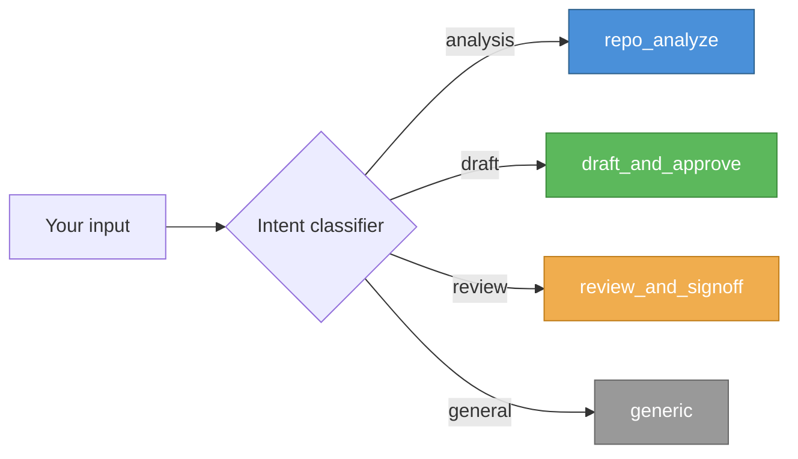
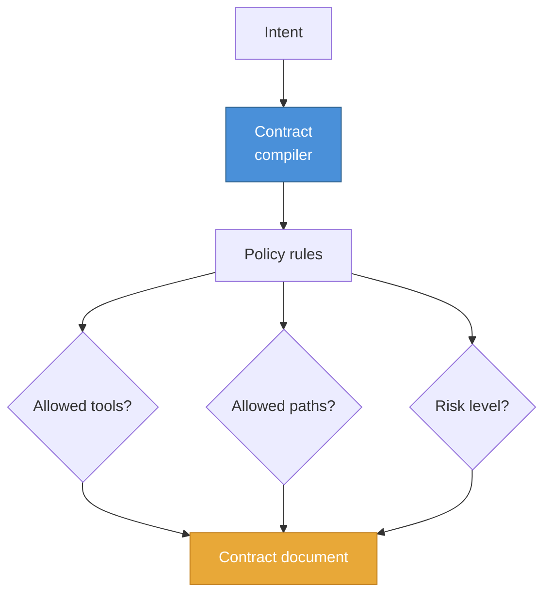
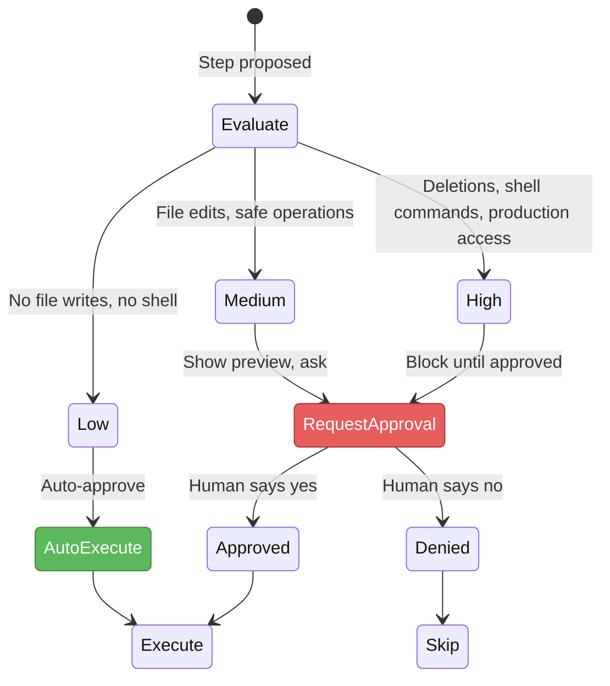
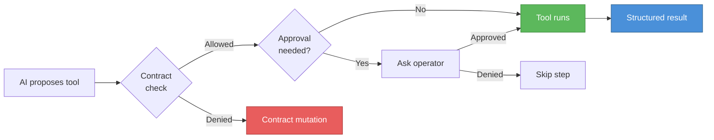
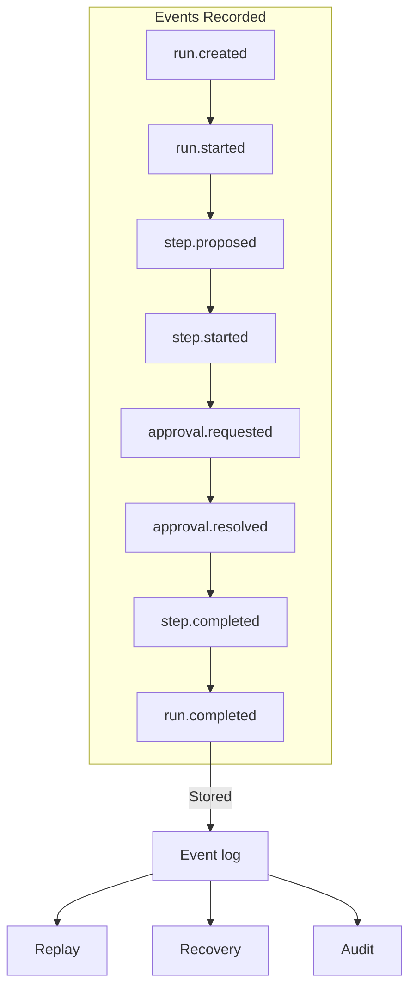
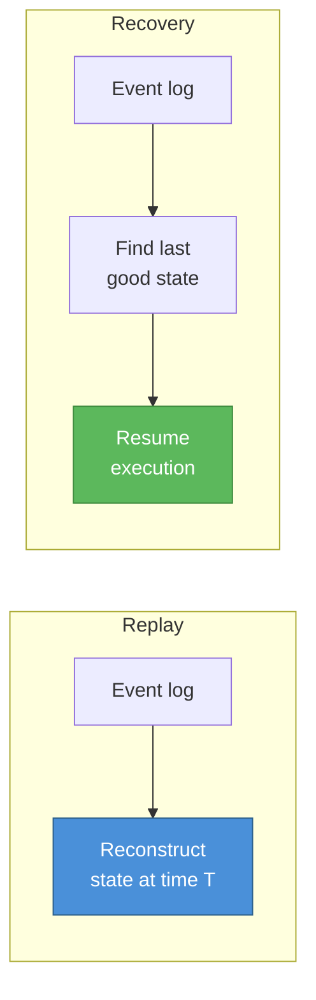
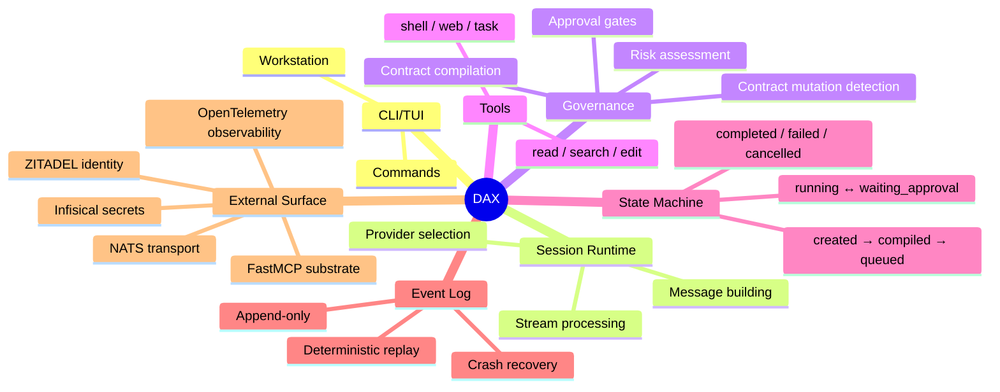

# How DAX Works

A visual overview of DAX's internals. For deeper details, see the [full architecture docs](./ARCHITECTURE.md) and [execution model](./DAX_EXECUTION_MODEL.md).

## The Complete Flow

```mermaid
graph TB
    subgraph "Input"
        User[You]
        Intent[Intent<br/>"fix this bug"]
    end

    subgraph "Governance Engine"
        Contract[Contract<br/>compilation]
        Risk[Risk<br/>assessment]
        Approval[Approval<br/>gate]
    end

    subgraph "Execution"
        Plan[Plan<br/>build]
        Steps[Execute<br/>steps]
        Tools[Tools<br/>run]
    end

    subgraph "Output"
        Artifacts[Artifacts<br/>produced]
        Audit[Audit<br/>trust score]
        EventLog[Event<br/>log]
    end

    User -->|"type"| Intent
    Intent --> Contract
    Contract --> Risk
    Risk -->|"low"| Plan
    Risk -->|"medium/high"| Approval
    Approval -->|"approved"| Plan
    Plan --> Steps
    Steps --> Tools
    Tools --> Artifacts
    Steps --> EventLog
    Artifacts --> Audit
    EventLog --> Audit

    style Contract fill:#4a90d9,stroke:#2c5f8a,color:#fff
    style Risk fill:#e8a838,stroke:#c07d1a,color:#fff
    style Approval fill:#e85d5d,stroke:#a33,color:#fff
    style EventLog fill:#5cb85c,stroke:#3d8b3d,color:#fff
```

## 1. Intent

An intent is a natural-language description of what you want done.

DAX classifies the intent into a **workflow**:



The workflow determines which contract DAX builds and which approval gates apply.

## 2. Contract Compilation

A **contract** is a compiled set of rules for a specific run. It defines:

- which tools the run can use
- which files the run can access
- what risk level the run operates at
- which actions require approval



Once compiled, the contract **cannot change** during the run. If the AI tries to do something outside the contract, DAX detects a **contract mutation** and fails the run.

## 3. Risk Assessment and Approvals

Every step is evaluated for risk. DAX uses the contract's risk rules to decide:



## 4. Execution with Tools

DAX uses **tools** to take real actions. Each tool is scoped and governed:

| Tool       | What it does  | Risk   |
| ---------- | ------------- | ------ |
| `read`     | Read a file   | Low    |
| `glob`/`grep`/`codesearch` | Search code | Low |
| `edit`/`write`/`apply_patch` | Modify a file | Medium |
| `shell`    | Run a command | High   |
| `webfetch`/`websearch` | Fetch a URL | Medium |

> Tool ids are simplified here for a visual overview. The canonical classification is in
> `packages/dax/src/tool/tool-class.ts:24-30` (`EDIT_TOOL_IDS`, `SHELL_TOOL_IDS`, `READ_TOOL_IDS`).



## 5. Event Log

Every action DAX takes is recorded in an **event log**. This is the foundation for:

- **Audit** — review what happened
- **Replay** — reconstruct what the AI did
- **Recovery** — resume after a crash
- **Accountability** — prove what was done



Events can also be published to **NATS/JetStream** for external consumption (Soothsayer, dashboards, integrations).

## 6. Replay and Recovery

**Replay** reads the event log and reconstructs the run state at any point in time.

**Recovery** reads the event log, finds the last known good state, and resumes from there.



## 7. System Map



## Further Reading

- [Full Architecture](./ARCHITECTURE.md) — system layers and runtime components
- [Execution Model](./DAX_EXECUTION_MODEL.md) — lifecycle, objects, and interfaces
- [Trust Model](./DAX_TRUST_MODEL.md) — evidence-based trust and safety
- [Stack Roadmap](../OPEN_SOURCE_STACK_ROADMAP.md) — integration phases and infrastructure
