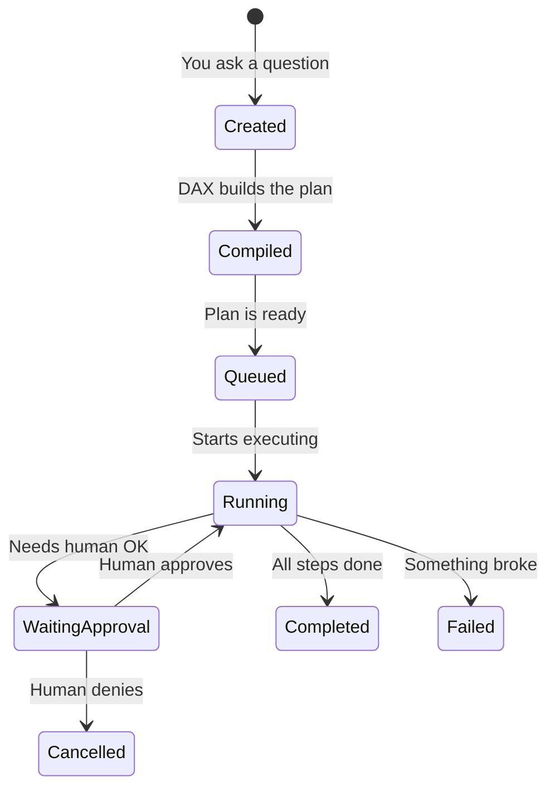
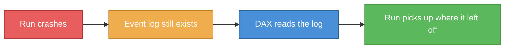
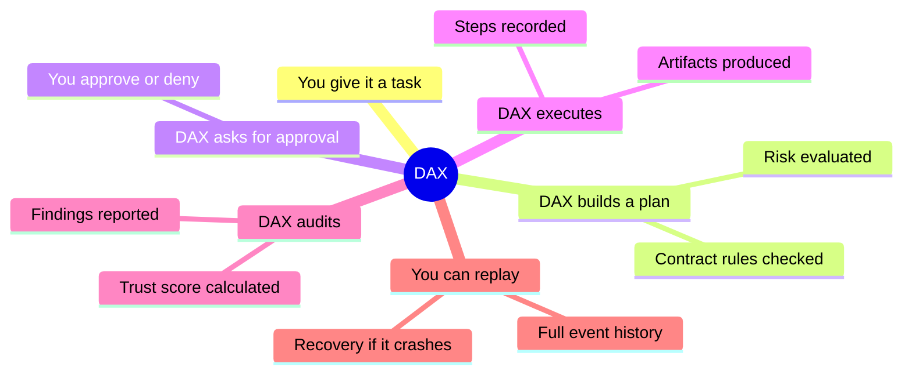

# DAX In Simple Words

This guide explains DAX using everyday analogies. No technical background needed.

## The Analogy: An Airport Control Tower

Imagine an airport.

- **You** are the pilot. You know where you want to go.
- **DAX** is the air-traffic controller. It decides which runway to use, checks the weather, and clears you for takeoff.
- **Soothsayer** is the control tower — the place where human operators watch every flight and can step in if something looks wrong.
- **Picobot** is your radio. You talk to the tower through it.
- **Workspace MCP** is the airport rulebook. It says what planes can fly where, and what needs a check first.

```mermaid
graph TB
    subgraph "You"
        P[You type: "Fix this bug"]
    end
    subgraph "Radio"
        Radio[Picobot<br/>reads your message]
    end
    subgraph "Air Traffic Control"
        DAX[DAX<br/>plans the flight path]
    end
    subgraph "Control Tower"
        Soothsayer[Soothsayer<br/>humans watch and approve]
    end
    subgraph "Rulebook"
        MCP[Workspace MCP<br/>the airport rules]
    end

    P -->|"Fix this bug"| Radio
    Radio -->|"intent"| DAX
    DAX -->|"uses"| MCP
    DAX -->|"requests clearance"| Soothsayer
    Soothsayer -->|"approved ✅"| DAX
    DAX -->|"fixes the bug"| P

    style DAX fill:#4a90d9,stroke:#2c5f8a,color:#fff
    style Soothsayer fill:#7b68ee,stroke:#5a4bb8,color:#fff
    style Radio fill:#5cb85c,stroke:#3d8b3d,color:#fff
    style MCP fill:#f0ad4e,stroke:#c07d1a,color:#fff
    style P fill:#f0f0f0,stroke:#333
```

## What Is a "Run"?

A run is one flight.

When you say "fix this bug", DAX creates a **run**. That run is a recorded sequence of steps:

1. The AI proposes what to do.
2. DAX checks if it's allowed (using the rulebook).
3. If it's risky, DAX asks a human: "Is this okay?"
4. The human says yes or no.
5. The step executes (or doesn't).
6. Everything gets recorded.



At the end, you have a **full transcript** — like a flight recorder — that shows exactly what happened.

## What Is an Approval?

Some actions are risky. Deleting a file. Merging code. Running a command that affects production.

When DAX encounters a risky step, it **stops and asks**. This is called an **approval**.

```
DAX: "I want to delete src/old-thing.ts. OK?"
You: "Yes" or "No"
```

Nothing risky happens without your say-so. Ever.

## What Is Replay?

Since DAX records every step, you can **replay** any run from its event log.

Think of it like rewinding a recording of your flight. You can see exactly what the AI proposed, what was approved, what executed, and what went wrong.

This is useful for:

- debugging why something went wrong
- showing your team what the AI did
- learning from past runs

## What Is Recovery?

If the system crashes mid-flight, DAX can **recover**.

It reads the event log, figures out where it left off, and picks up from there. Like a flight recorder that helps investigators reconstruct what happened.



## What Makes DAX Different?

Most AI tools are chatbots. You ask a question, it answers, and that's it.

DAX is different because:

- **It records everything** — you can see exactly what the AI did
- **It asks before acting** — risky steps require your approval
- **It recovers from crashes** — your work isn't lost if something breaks
- **It's deterministic** — the same inputs produce the same execution path
- **It's auditable** — you can prove what happened and when

## Quick Mind Map



## Next Steps

- **Ready to try?** Read [Quickstart](./QUICKSTART.md) to install DAX and run your first workflow.
- **Want the full picture?** Read [How DAX Works](../architecture/HOW_DAX_WORKS.md) for the technical deep dive.
- **Curious about trust?** Read [Runs, Approvals and Recovery](./RUNS_APPROVALS_AND_RECOVERY.md) for practical details.
