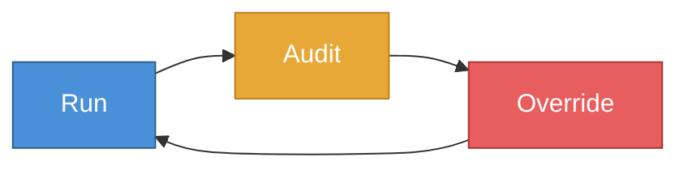
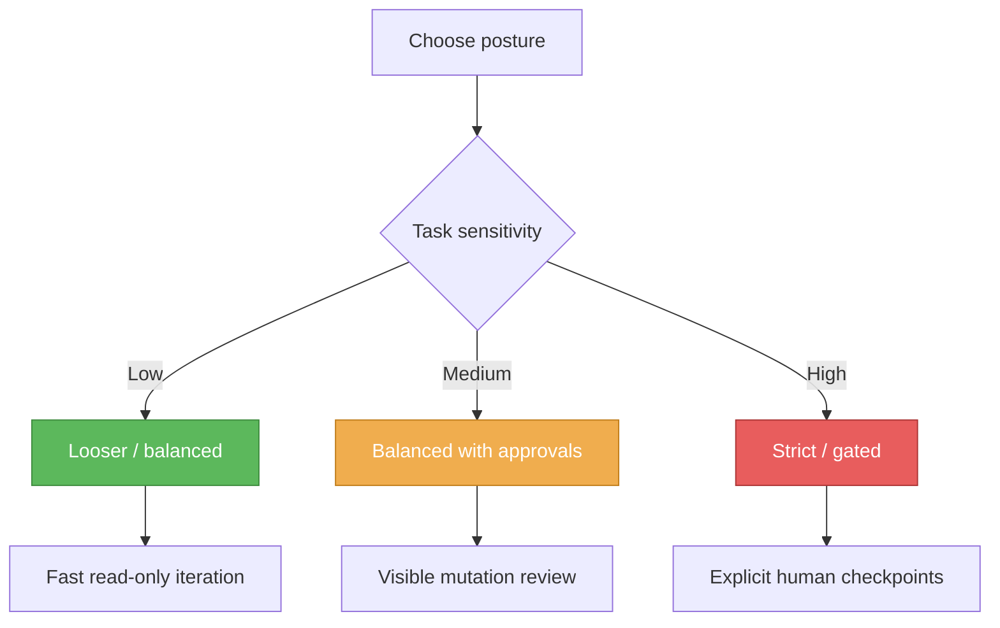

# Policy Customization and RAO Tuning

This guide explains how to think about DAX governance as something you can tune, not just tolerate.

The goal is not maximum friction. The goal is the right amount of friction for the risk of the task.

## The RAO Principle

RAO stands for:

- `Run`
- `Audit`
- `Override`

In practice, it means DAX should:

- do safe work efficiently
- surface risky work clearly
- let humans intervene where it matters



## What You Can Tune

Different teams want different postures.

Some teams want speed. Others want stricter review.

Typical governance levers include:

- when approvals are required
- which tool categories are allowed automatically
- which actions should always ask first
- what counts as acceptable risk for a workflow

## A Useful Mental Model

Think in terms of posture, not perfection.

### Balanced posture

Good for:

- everyday engineering work
- normal repo analysis
- careful but not exhausting review loops

Typical behavior:

- read-only work flows easily
- edits and shells get more attention
- obvious risk surfaces pause more often

### Strict posture

Good for:

- release work
- sensitive repositories
- compliance-heavy environments
- teams that want more explicit approvals

Typical behavior:

- more actions ask first
- mutation and shell operations get tighter scrutiny

## Where Policy Shows Up Today

In the current product, you will see policy behavior through:

- approvals
- permission prompts
- workflow execution modes
- trust and audit outputs
- PM rules and guardrails

The codebase also includes policy profile surfaces such as balanced and strict modes in the workstation.

## Practical Tuning Strategies

### Strategy 1: Tighten mutation, not reading

This is often the best default.

Allow:

- read
- list
- search
- inspect

Scrutinize:

- edit
- write
- shell

### Strategy 2: Gate release-sensitive actions

Examples:

- publishing
- tagging
- release scripts
- deployment actions

These are often worth explicit approval even when normal development work is more relaxed.

### Strategy 3: Use PM rules for local guardrails

Examples:

```text
/pm rules add require_approval release:publish ask
/pm rules add require_approval git push ask
```

This helps shape behavior without forcing every operator to rediscover the same constraints.

## What Teams Should Decide Explicitly

Before broad rollout, decide:

- what actions always require approval
- what your acceptable mutation posture is
- whether release work should be stricter than normal dev work
- whether shell access should be broad, limited, or heavily gated

## What Good Governance Feels Like

Good governance should feel:

- visible
- understandable
- proportional
- consistent

It should not feel arbitrary, theatrical, or so noisy that people stop paying attention.

## When to Tighten Policy

Tighten governance when:

- you are near release
- the repo is sensitive
- the change is destructive
- the cost of a mistake is high

## When to Loosen Policy

Loosen governance when:

- the task is exploratory and read-only
- the repo is a sandbox
- the actions are reversible and low-risk



## Related Guides

- [Runs, Approvals and Recovery](./RUNS_APPROVALS_AND_RECOVERY.md)
- [Tool Reference and Risk Matrix](./TOOLS_AND_RISK_MATRIX.md)
- [Project Memory Guide](./PROJECT_MEMORY.md)
