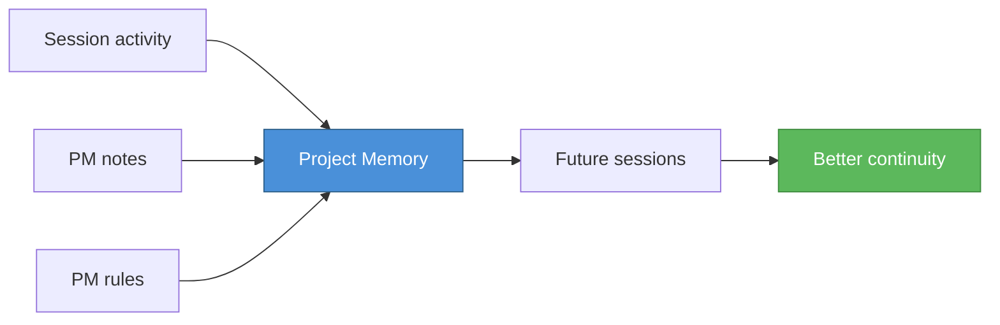
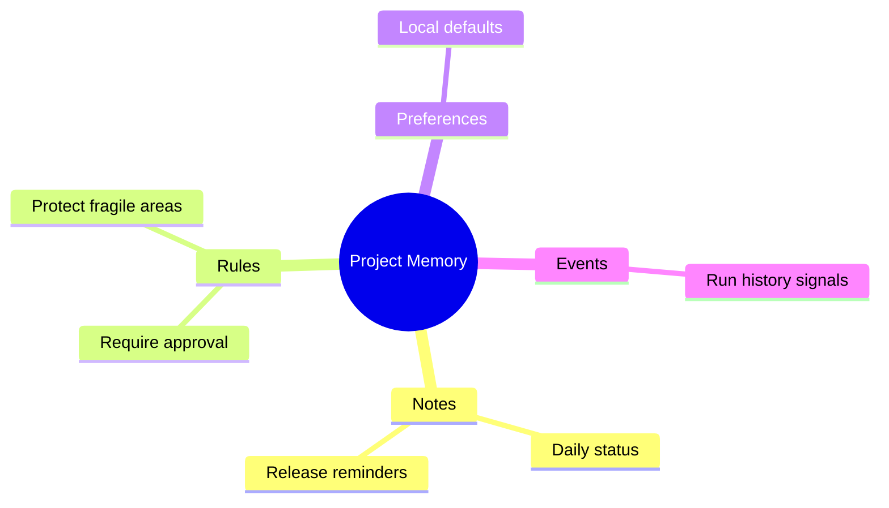

# Project Memory and Daily Status Reports

> **Command surface note**: the in-session slash commands are `/pm note`,
> `/pm list`, `/pm rules`, and `/pm rules add` (session/prompt.ts:2155-2158).
> Architectural memory is written/read through the `save_memory` /
> `list_memory` PM module functions (packages/dax/src/pm/index.ts:453,483),
> surfaced in the TUI memory pane — not through a `/pm memory ...` slash
> command. The `/pm memory` syntax below is illustrative of those functions,
> not a shipped slash command.

Project Memory, or `PM`, is DAX's local memory layer for durable project context.

It is meant to help DAX remember lightweight operational context between sessions without pretending to be a mystical long-term brain.



## What Project Memory Is

Project Memory stores useful project-specific signals such as:

- daily status report notes
- lightweight rules and guardrails
- preferences
- run-related events
- **architectural decisions** (durable work memory)

In practice, PM helps DAX carry forward practical context:

- what matters in this project
- what should be treated carefully
- what has already been noted recently

## What PM Is Not

PM is not:

- a secret cloud service
- a replacement for source control
- a substitute for formal documentation
- a place to hide credentials

It is local operational memory for the current project context.

## Why PM Exists

Without some persistent memory, every new session starts flatter than it should.

PM gives DAX a way to keep important local notes like:

- release reminders
- architectural cautions
- team constraints
- review and approval rules

## Everyday PM Commands

### Save a note

```text
/pm note <title> | <note> | <tag1,tag2>
```

Example:

```text
/pm note Release posture | Stable release requires release:verify before tagging | release,quality
```

### List notes

```text
/pm list
```

You can also filter by day:

```text
/pm list 2026-03-26
```

### View rules

```text
/pm rules
```

### Add a rule

```text
/pm rules add <type> <pattern> <action>
```

Example:

```text
/pm rules add require_approval release:publish ask
```

## Common Uses

PM is especially useful for:

- saving status updates
- recording local project constraints
- reminding DAX that certain actions deserve approval
- preserving operational context between sessions

## What Happens in the TUI

The TUI includes PM-oriented affordances so you can:

- save a PM note
- list recent PM notes
- inspect PM rules

This makes PM part of everyday workflow, not a hidden advanced feature.

## A Good Mental Model

Think of PM as the project's local notebook:

- short-lived enough to stay practical
- durable enough to matter
- structured enough to be useful

## Suggested Use for Teams

Use PM for information like:

- `never touch production config without review`
- `release publishing requires approval`
- `this folder is legacy and fragile`
- `prefer docs-only fixes before code changes during release week`

That is the kind of memory that improves operations without becoming noise.



## Safety Notes

- keep credentials out of PM
- use PM for guidance, not secrets
- use source control and docs for canonical long-term decisions

## Related Guides

- [User Guide](./USER_GUIDE.md)
- [Policy Customization and RAO Tuning](./POLICY_TUNING.md)

### Save Architectural Memory

```text
/pm memory save <category> <title> | <content> | <tag1,tag2>
```

Categories: `architecture`, `decision`, `pattern`, `preference`, `learning`

Example:

```text
/pm memory save architecture Core API Design | The API uses a service layer pattern to decouple business logic from HTTP concerns | api,architecture
```

### List Architectural Memory

```text
/pm memory list
/pm memory list --category architecture
```

## Related Guides

- [User Guide](./USER_GUIDE.md)
- [Policy Customization and RAO Tuning](./POLICY_TUNING.md)
- [Tool Reference and Risk Matrix](./TOOLS_AND_RISK_MATRIX.md)
