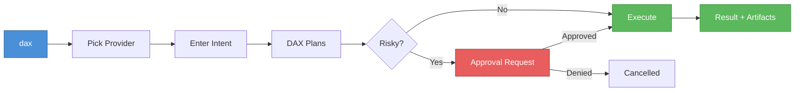

# DAX Quickstart

Get DAX running on your machine in under 5 minutes.

If you want the plain-English version first, read [DAX for Non-Developers](./NON_DEVELOPERS.md).

## Prerequisites

- macOS, Linux, or Windows (WSL)
- [Bun](https://bun.sh) 1.3+ (for developer installs)
- A model provider API key (OpenAI, Google, Anthropic, etc.)

## Option A: Binary Install (fastest)

### macOS / Linux

```bash
curl -fsSL https://raw.githubusercontent.com/ShaileshRawat1403/dax-tui/main/script/install.sh | bash
```

### macOS / Linux (Homebrew)

```bash
brew install ShaileshRawat1403/tap/dax
```

### Windows (WinGet)

```powershell
winget install DaxAi.DAX
```

### Verify

```bash
dax --version
```

## Option B: Developer Install

```bash
git clone https://github.com/ShaileshRawat1403/dax-tui.git
cd dax-tui
bun install
cd packages/dax
bun link
```

## Configure a Provider

Set your model provider credentials:

```bash
# OpenAI
export OPENAI_API_KEY="sk-..."

# Google Gemini
export GEMINI_API_KEY="..."

# Anthropic
export ANTHROPIC_API_KEY="sk-ant-..."
```

Or use the built-in auth manager:

```bash
dax auth login
```

Authentication is usually local to your machine and OS user account. If DAX already appears connected in another repository, that normally means you already authenticated on this machine earlier.

The Google/Gemini auth picker shows two direct provider lanes by default:

- `Gemini API Key`
- `Google OAuth Client Sign-In`

Google ended consumer Gemini CLI service on June 18, 2026. To use an
individual Google AI subscription as a governed coding worker, install and
authenticate Antigravity CLI, then run:

```bash
dax worker run antigravity -- "<task>"
```

The old Gemini CLI import is an enterprise compatibility lane hidden behind
`DAX_ENABLE_LEGACY_GEMINI_CLI_IMPORT=1`.

`Google OAuth Client Sign-In` is the browser-based lane. If `DAX_GOOGLE_CLI_CLIENT_ID` and `DAX_GOOGLE_CLI_CLIENT_SECRET` are configured, DAX can use them directly. Otherwise it will prompt for your own Google OAuth client credentials.

If DAX later says the Gemini subscription lane is busy, it will wait and retry automatically. If that keeps happening, wait a bit or switch to `Gemini API Key`.

For Anthropic / Claude Pro or Max users, note that Anthropic now meters some third-party app usage through extra usage credit instead of the normal plan bucket. If a Claude lane suddenly behaves differently, check `claude.ai/settings/usage` before assuming DAX lost your auth state.

## First Run

```bash
dax
```

You'll see the DAX workstation. Start with a safe intent first, then let DAX build context before you move into edits.

Recommended first prompt:

```text
Explore this repository. Map the entry points, execution flow, key files, unknowns, and next reading targets.
```

If anything about setup looks unclear, run:

```bash
dax doctor
```

Use `dax doctor --json` when you want machine-readable readiness output.



## First Workflow: Repo Analysis

Try DAX's most common workflow:

```bash
# From your repo root
dax
```

Then type:

```
Analyze this repository for security vulnerabilities and code quality issues
```

DAX will:

1. Detect your intent as `repo_analyze`
2. Build a contract (what it will and won't do)
3. Execute the analysis
4. Pause for approval if a risky step needs operator review
5. Present findings, risk scores, and recommendations

## Enable the FastMCP Substrate

To use DAX programmatically (e.g., from CI or other tools):

```bash
DAX_SUBSTRATE_ENABLED=true \
DAX_SUBSTRATE_TOKEN=mysecret \
DAX_SUBSTRATE_PORT=4730 \
bun run packages/dax/src/index.ts
```

Then call it:

```bash
curl -X POST http://localhost:4730/ \
  -H "Authorization: Bearer mysecret" \
  -H "Content-Type: application/json" \
  -d '{
    "jsonrpc": "2.0",
    "id": 1,
    "method": "tools/call",
    "params": {
      "name": "run.create",
      "arguments": {
        "intent": { "input": "check this repo for outdated dependencies" }
      }
    }
  }'
```

## Next Steps

- **Understand the system:** [DAX In Simple Words](./DAX_IN_SIMPLE_WORDS.md)
- **Use the fastest guided path:** [Start Here](./start-here.md)
- **Read the context behind the project:** [Builder's Note](../BUILDERS_NOTE.md)
- **Use the plain-English guide:** [DAX for Non-Developers](./NON_DEVELOPERS.md)
- **See how runs work:** [Runs, Approvals and Recovery](./RUNS_APPROVALS_AND_RECOVERY.md)
- **Deploy for real:** [Deployment Guide](../OPEN_SOURCE_STACK_DEPLOYMENT.md)
- **Set up CI:** [Stack Roadmap](../OPEN_SOURCE_STACK_ROADMAP.md) — GitHub Actions section
