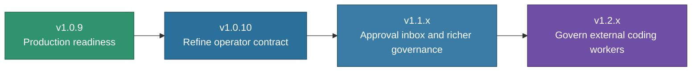

# DAX Roadmap

> **Status note**: The releases tracked here (v1.0.9 through v1.2.x) have all
> shipped; the current version is 1.3.0. Retained as a record of the phase-3
> roadmap. See `WHAT_IS_DAX.md` "Where DAX Is Heading" for the shipped path.

This roadmap explains the near-term product direction for DAX after the Phase 3 architecture work.

## Product Direction

DAX is moving from “impressive internal system” to “ready-to-use governed execution product.”

That means the next releases should focus on:

- truthful readiness
- first-run clarity
- stronger operator workflows
- multi-surface governance

## Release Path

## `v1.0.10` — Refine Becomes an Operator Contract

Theme:

> DAX starts turning prompt refinement into a governed execution-planning surface.

Focus areas:

- refine contract v2
- clearer repo impact and governance forecasting
- better right-pane control rail
- more useful finish states and operator next moves
- sharper DAX-native TUI polish

Success means:

- refine feels like a real operator tool, not just prompt cleanup
- the right pane explains where the live run is going and what to do next
- completed runs end with helpful operator moves when the state warrants them
- the DAX theme and session surfaces feel deliberate again

## `v1.0.9` — Production Readiness

Theme:

> DAX becomes easier to trust, easier to understand, and more coherent to operate.

Focus areas:

- truthful doctor/readiness output
- first-run operator guidance
- cleaner governance language
- release surface alignment
- stronger default theme and operator chrome

Success means:

- a new user can install DAX and understand the first useful action quickly
- setup issues are explained cleanly
- approvals, diffs, and pauses feel coherent
- release notes, versioning, and docs tell one story

## `v1.1.x` — Richer Governance Workflows

Theme:

> DAX approvals become a complete operator workflow, not just a TUI surface.

Likely priorities:

- richer approval inbox
- better grouping of approvals and proposed changes
- stronger “why paused / what next” surfaces
- improved review and sign-off workflows
- more durable release and handoff operations

## `v1.2.x` — Govern External Coding Workers

Theme:

> Bring your own coding agent; keep DAX governance.

Priorities:

- disposable worker checkouts with kernel-computed diffs
- operator-authored or confirmed scope and verification contracts
- DAX-owned verification receipts before review
- OS isolation that fails closed when unavailable
- Flowright capability receipts without duplicate run authority

Remote operator continuity remains a later suite concern. It does not belong
inside the DAX worker proof and should not widen this release.

## What Not To Do Too Early

The roadmap should avoid spending the next releases on:

- more architecture churn without product payoff
- generic assistant features that do not strengthen DAX’s identity
- integrations that add surface area without improving operator control

## Product Principle

Each release should strengthen this sentence:

> DAX is the governed execution workstation for AI-driven software work.

If a feature makes DAX look more like a generic coding assistant, it is probably lower priority than it first appears.

## Related Guides

- [Positioning](./POSITIONING.md)
- [What Is DAX?](./WHAT_IS_DAX.md)
- [Release Readiness](./release-readiness.md)
