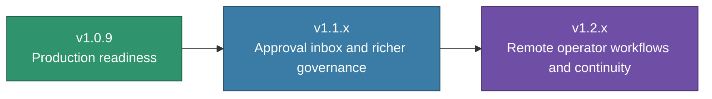

# DAX Roadmap

This roadmap explains the near-term product direction for DAX after the Phase 3 architecture work.

## Product Direction

DAX is moving from “impressive internal system” to “ready-to-use governed execution product.”

That means the next releases should focus on:

- truthful readiness
- first-run clarity
- stronger operator workflows
- multi-surface governance

## Release Path

## `v1.0.9` — Production Readiness

Theme:

> DAX becomes easier to trust, easier to understand, and more coherent to operate.

Focus areas:

- truthful doctor/readiness output
- first-run operator guidance
- cleaner governance language
- release surface alignment
- stronger default theme and operator chrome

Success means:

- a new user can install DAX and understand the first useful action quickly
- setup issues are explained cleanly
- approvals, diffs, and pauses feel coherent
- release notes, versioning, and docs tell one story

## `v1.1.x` — Richer Governance Workflows

Theme:

> DAX approvals become a complete operator workflow, not just a TUI surface.

Likely priorities:

- richer approval inbox
- better grouping of approvals and proposed changes
- stronger “why paused / what next” surfaces
- improved review and sign-off workflows
- more durable release and handoff operations

## `v1.2.x` — Remote Operator Continuity

Theme:

> DAX expands from a strong local workstation into a broader governance system.

Likely priorities:

- Soothsayer-backed approval resolution
- remote operator inbox and review
- notifications for approvals and interventions
- stronger continuity between local DAX, PM memory, and shared governance layers

## What Not To Do Too Early

The roadmap should avoid spending the next releases on:

- more architecture churn without product payoff
- generic assistant features that do not strengthen DAX’s identity
- integrations that add surface area without improving operator control

## Product Principle

Each release should strengthen this sentence:

> DAX is the governed execution workstation for AI-driven software work.

If a feature makes DAX look more like a generic coding assistant, it is probably lower priority than it first appears.

## Related Guides

- [Positioning](./POSITIONING.md)
- [What Is DAX?](./WHAT_IS_DAX.md)
- [Release Readiness](./release-readiness.md)
