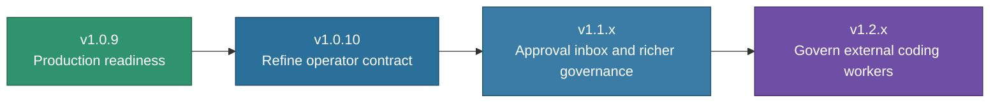

# DAX Roadmap

Released baseline: **DAX v1.5.0**, released 2026-09-20. The conformance sprint's
original scope was nine aggregate gaps; eight remain open. Work resumed on
2026-09-26 after the maintainer's absence, proposal before runtime implementation.
The home visual pass is integrated in checkpoint source,
which remains unreleased. The older release plan
below is retained as historical context.

## Conformance Sprint — Closure in Progress

Implementation model: Sol. Reviewer: Astra 6 high.
Status: resumed from source `main` at `0170d2f8137bbd0abab7d9f6d72837ca5cec59f0`.
The [capability registry proposal](../roadmap/CAPABILITY_REGISTRY_PROPOSAL.md)
awaits Astra's architecture review; no new gap is closed. The complete-event-history workstream, including compaction
replacement, is integrated in `main` at `7ccfc8a4cdd93ff054cabe2c43197438b88e8995`.
Accepted record-class coverage is **11/11** and `inv1.record-classes` is closed;
the other **eight aggregate gaps** remain open in the
[sprint backlog and acceptance plan](../roadmap/CONFORMANCE_SPRINT.md).
See [current status](../DAX_STATUS.md) and the
[post-merge CI](https://github.com/ShaileshRawat1403/dax/actions/runs/35872303816)
for integration evidence. This is not a new release. The checkpoint does not claim
complete historical coverage, provider receipt, or release readiness.

| Workstream | Gaps | Intended outcome |
| --- | --- | --- |
| Complete event history | 1 closed | Integrated within documented producer and historical-coverage boundaries. |
| Shared capability permissions | 4 | Name capabilities, validate their properties, express contract grants, and enforce them consistently across execution paths. |
| Project scope and governed memory | 4 | Reuse journal machinery, identify event ownership, persist project facts, and connect an authorized memory writer. |

Dependencies determine implementation order: project journaling and grant
resolution precede memory promotion. Closure requires production behavior and
regression evidence; a file-existence check is insufficient. The eight unfinished
gaps stay open in the ledger and are carried forward at sprint review. No release
number or calendar deadline is committed yet.

The two integrity gaps closed in v1.5.0 remain regression requirements, not new
backlog items. The historical v1.4.0 claims pack remains frozen.

## Discussion backlog — bounded advisory checks

Recorded 2026-09-22. **Idea only: unscheduled, not approved for implementation.**
This does not add work to the active conformance sprint.

Explore Jev's pattern of narrow independent questions against one stable snapshot,
adapted to DAX's existing Shadow Auditor. The candidate questions are whether a
compiled contract matches the user's intent and whether its validation plan would
demonstrate the requested outcome. DAX retains execution and approval authority.

Before runtime development, discuss a small evaluation comparing the current
single audit, one structured call answering both questions, and two concurrent
calls using existing providers. Use the same manually reviewed cases and compare
useful findings, missed problems, false alarms, latency, and usage. Concurrent
calls must earn their added cost; they do not reproduce Jev's internal model
architecture or establish calibrated confidence.

Any later pilot would remain optional and advisory, with bounded input, timeouts,
and explicit unavailable results. The current auditor runs asynchronously; this
idea does not promise assessment before execution. Authorization changes,
parallel coding workers, a generic judgment framework, cross-project rollout,
and Jev API integration are outside this candidate's initial scope. No new
conformance claim or gap closure follows from an advisory experiment.

## Historical Phase-3 Roadmap

The sections below preserve the earlier v1.0.9–v1.2.x product direction.

## Product Direction

DAX is moving from “impressive internal system” to “ready-to-use governed execution product.”

That means the next releases should focus on:

- truthful readiness
- first-run clarity
- stronger operator workflows
- multi-surface governance

## Release Path

## `v1.0.10` — Refine Becomes an Operator Contract

Theme:

> DAX starts turning prompt refinement into a governed execution-planning surface.

Focus areas:

- refine contract v2
- clearer repo impact and governance forecasting
- better right-pane control rail
- more useful finish states and operator next moves
- sharper DAX-native TUI polish

Success means:

- refine feels like a real operator tool, not just prompt cleanup
- the right pane explains where the live run is going and what to do next
- completed runs end with helpful operator moves when the state warrants them
- the DAX theme and session surfaces feel deliberate again

## `v1.0.9` — Production Readiness

Theme:

> DAX becomes easier to trust, easier to understand, and more coherent to operate.

Focus areas:

- truthful doctor/readiness output
- first-run operator guidance
- cleaner governance language
- release surface alignment
- stronger default theme and operator chrome

Success means:

- a new user can install DAX and understand the first useful action quickly
- setup issues are explained cleanly
- approvals, diffs, and pauses feel coherent
- release notes, versioning, and docs tell one story

## `v1.1.x` — Richer Governance Workflows

Theme:

> DAX approvals become a complete operator workflow, not just a TUI surface.

Likely priorities:

- richer approval inbox
- better grouping of approvals and proposed changes
- stronger “why paused / what next” surfaces
- improved review and sign-off workflows
- more durable release and handoff operations

## `v1.2.x` — Govern External Coding Workers

Theme:

> Bring your own coding agent; keep DAX governance.

Priorities:

- disposable worker checkouts with kernel-computed diffs
- operator-authored or confirmed scope and verification contracts
- DAX-owned verification receipts before review
- OS isolation that fails closed when unavailable
- Flowright capability receipts without duplicate run authority

Remote operator continuity remains a later suite concern. It does not belong
inside the DAX worker proof and should not widen this release.

## What Not To Do Too Early

The roadmap should avoid spending the next releases on:

- more architecture churn without product payoff
- generic assistant features that do not strengthen DAX’s identity
- integrations that add surface area without improving operator control

## Product Principle

Each release should strengthen this sentence:

> DAX is the governed execution workstation for AI-driven software work.

If a feature makes DAX look more like a generic coding assistant, it is probably lower priority than it first appears.

## Related Guides

- [Positioning](./POSITIONING.md)
- [What Is DAX?](./WHAT_IS_DAX.md)
- [Release Readiness](./release-readiness.md)
