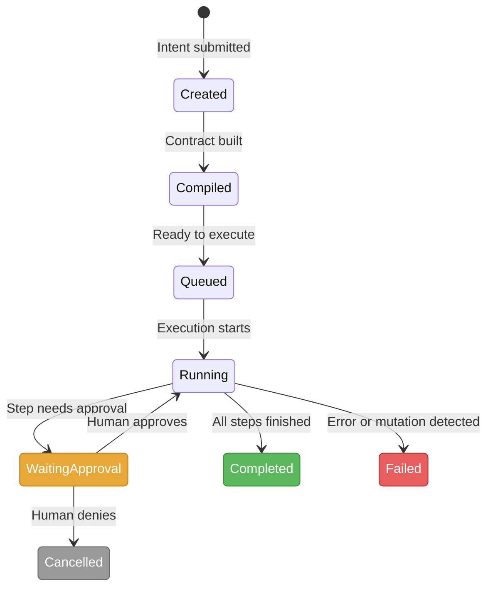
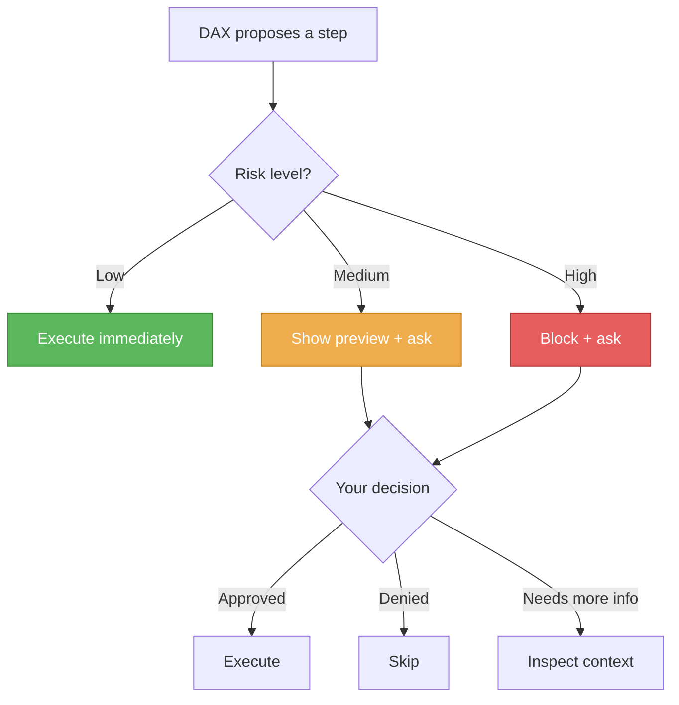
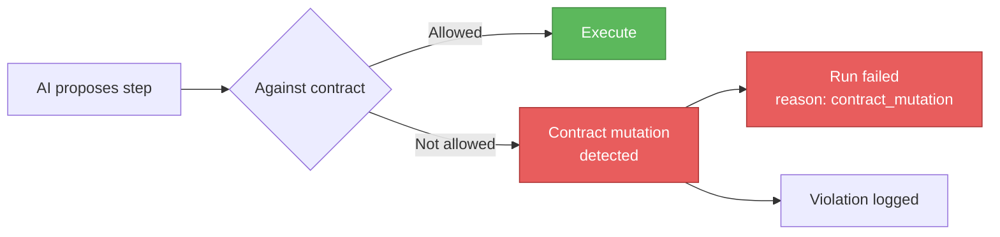
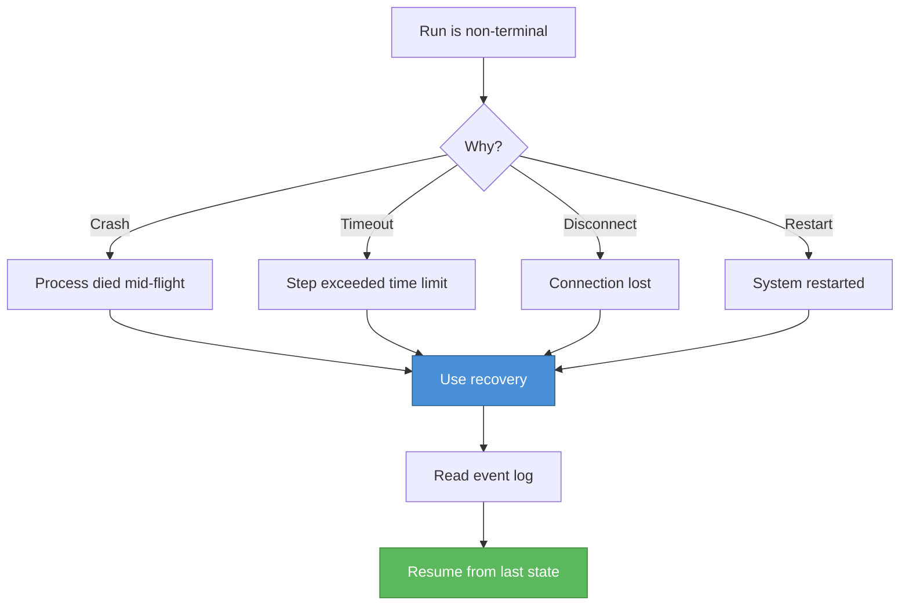

# Runs, Approvals and Recovery

A practical guide to the core objects you'll encounter when using DAX.

## What Is a Run?

A run is a single execution of a workflow. When you type an intent into DAX, it creates a run that tracks everything: the plan, the steps, the approvals, and the outcome.

### Run Lifecycle



### Terminal States

A run is **terminal** when it reaches one of:

| Status      | Meaning                                               |
| ----------- | ----------------------------------------------------- |
| `completed` | All steps executed successfully                       |
| `failed`    | An error occurred or a contract mutation was detected |
| `cancelled` | A human denied an approval                            |

Terminal runs **cannot be recovered**. To retry, create a new run with the same intent.

### Non-Terminal States

A run is **non-terminal** when it's in one of:

| Status             | Meaning                          |
| ------------------ | -------------------------------- |
| `created`          | Run created but not yet compiled |
| `compiled`         | Contract built, ready to queue   |
| `queued`           | Waiting for execution slot       |
| `running`          | Actively executing steps         |
| `waiting_approval` | Paused for human approval        |

Non-terminal runs **can be recovered** — DAX reads the event log and picks up where it left off.

## What Is an Approval?

An approval is a **pause** in execution when DAX encounters a risky step.

### When Approvals Appear



### Approval Flow in Soothsayer

If you're using Soothsayer (the web dashboard), approvals appear in the **Inbox**:

1. A step hits an approval gate
2. Soothsayer shows the step details, risk level, and affected files
3. You approve or deny
4. Execution resumes or skips

### Approval via FastMCP

If you're using DAX programmatically, approvals can be resolved via the FastMCP substrate:

```bash
# List pending approvals
curl -X POST http://localhost:4730/ \
  -H "Authorization: Bearer $TOKEN" \
  -H "Content-Type: application/json" \
  -d '{
    "jsonrpc": "2.0",
    "id": 1,
    "method": "tools/call",
    "params": {
      "name": "run.approvals.list",
      "arguments": { "runId": "run-abc123" }
    }
  }'

# Resolve an approval
curl -X POST http://localhost:4730/ \
  -H "Authorization: Bearer $TOKEN" \
  -H "Content-Type: application/json" \
  -d '{
    "jsonrpc": "2.0",
    "id": 2,
    "method": "tools/call",
    "params": {
      "name": "run.approvals.resolve",
      "arguments": {
        "runId": "run-abc123",
        "approvalId": "approval-xyz",
        "decision": "approve",
        "actorId": "operator-1",
        "comment": "Safe to proceed"
      }
    }
  }'
```

## What Is a Contract?

A contract is the **compiled rule set** for a run. It defines:

- which tools are available
- which files can be touched
- what risk level applies
- which steps require approval

### Contract Mutation

If the AI tries to do something the contract doesn't allow, DAX detects a **contract mutation**:



Contract mutations are the primary safety mechanism. They ensure the AI stays within the boundaries defined at run creation.

## What Is Recovery?

Recovery is the process of **resuming a non-terminal run** from its event log.

### When to Recover



### How Recovery Works

DAX reads the event log, reconstructs the run state (status, steps, pending approvals), and continues execution from where it left off.

### Recovery via FastMCP

```bash
# Get recovery summary
curl -X POST http://localhost:4730/ \
  -H "Authorization: Bearer $TOKEN" \
  -H "Content-Type: application/json" \
  -d '{
    "jsonrpc": "2.0",
    "id": 1,
    "method": "tools/call",
    "params": {
      "name": "run.recovery.get",
      "arguments": { "runId": "run-abc123" }
    }
  }'

# Execute recovery (non-terminal runs only)
curl -X POST http://localhost:4730/ \
  -H "Authorization: Bearer $TOKEN" \
  -H "Content-Type: application/json" \
  -d '{
    "jsonrpc": "2.0",
    "id": 2,
    "method": "tools/call",
    "params": {
      "name": "run.recovery.execute",
      "arguments": { "runId": "run-abc123" }
    }
  }'
```

## Terminal Reasons

When a run fails, DAX records a **terminal reason**:

| Reason              | Meaning                                       |
| ------------------- | --------------------------------------------- |
| `contract_mutation` | AI tried to do something outside the contract |
| `permission_denied` | An approval was denied                        |
| `timeout`           | A step or the run exceeded its time limit     |
| `error`             | An internal error occurred                    |
| `user_cancelled`    | The operator cancelled the run                |

## Trust Scoring

Every run gets a **trust score** based on:

- contract compliance (no mutations)
- approval response time
- artifact quality
- execution determinism (same inputs → same path)

## Further Reading

- [Quickstart](./QUICKSTART.md) — install and run your first workflow
- [How DAX Works](../architecture/HOW_DAX_WORKS.md) — architecture overview
- [Stack Roadmap](../OPEN_SOURCE_STACK_ROADMAP.md) — FastMCP tools, NATS events
- [Deployment Guide](../OPEN_SOURCE_STACK_DEPLOYMENT.md) — deployment profiles
