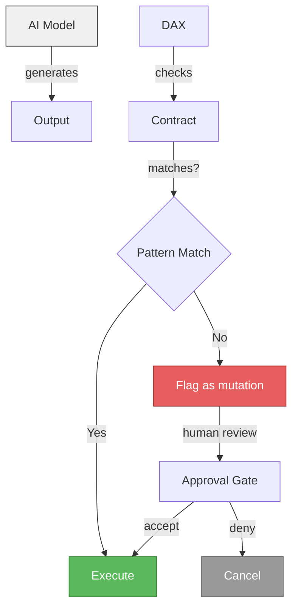
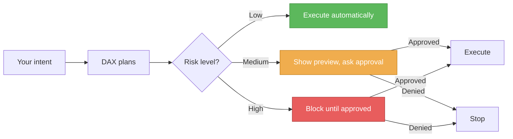

# Transparency and Limitations

DAX is designed for trust. This document explains what DAX can do, what it cannot guarantee, and why human oversight matters.

The short version: DAX provides a **deterministic runtime contract around stochastic model execution**. It governs how work proceeds, records what happened, and blocks risky transitions. It does not make the underlying model itself deterministic.

## What DAX Can Do

| Capability                                         | How                                                                                 |
| -------------------------------------------------- | ----------------------------------------------------------------------------------- |
| Execute multi-step workflows from natural language | Contract system compiles a bounded execution plan and enforces runtime guardrails   |
| Record every step                                  | Event log captures all proposals, approvals, decisions, and outcomes                |
| Replay any run from its event log                  | Replay reconstructs the execution path and runtime state transitions                |
| Recover from crashes                               | Event log recovery resumes from last known state                                    |
| Govern risky actions                               | Approval gates pause execution for human review                                     |
| Audit execution history                            | Trust scores, terminal reasons, and contract violations are tracked                 |

## What DAX Cannot Guarantee

## First-Class Limitations

- provider/auth variability can still affect runtime reliability even when DAX's own state machine is healthy
- probabilistic model outputs can still be wrong, incomplete, or inconsistent across runs
- completion proof is governance-valid, not a full semantic proof that the technical outcome is correct

### 1. Correctness of AI output

DAX governs _how_ AI executes, not _what_ the AI produces. The underlying model can:

- hallucinate (invent facts or code that doesn't exist)
- misunderstand your intent
- miss edge cases
- generate correct-looking but subtly wrong output

DAX catches some of this through **contract mutation detection** and **approval gates**, but it cannot prevent the model from being wrong.

### 2. Full autonomy is unsafe

DAX is intentionally **not fully autonomous**. The approval gates exist because:

- AI models can produce harmful actions (deleting files, exposing credentials, running destructive commands)
- Models cannot reliably judge context (production vs. development, personal vs. shared code)
- Human judgment is required for irreversible decisions

### 3. Provider dependency

DAX depends on external model providers (OpenAI, Google, Anthropic). Provider/auth variability remains a real limitation. If a provider:

- goes down — DAX cannot execute model-dependent steps
- changes its API — DAX may need updates
- charges more — costs are passed through to you

DAX mitigates this with multi-provider support and graceful degradation, but it cannot run without at least one working provider.

### 4. Not a security boundary

DAX provides governance, not sandboxing. An approved action can still:

- access files outside the project (if the contract allows it)
- run arbitrary shell commands (if approved)
- consume resources without limit (unless you set limits)

Use containerization (Docker, VMs) for true isolation. DAX is a control layer, not a sandbox.

## Why Approvals Matter

Every approval is an opportunity to:

- stop a wrong action before it happens
- verify that the AI understood your intent
- learn what the system considers risky

## Contract Immutability

DAX uses a **contract system** to lock down what a run is allowed to do. Once a contract is compiled, it cannot change mid-run.

If the AI tries to do something outside the contract, DAX detects a **contract mutation** and:

1. flags the run as failed
2. records the violation
3. requires a new contract (or a new run) to proceed

This prevents scope creep and keeps execution predictable, but it is still a governance-valid guarantee rather than a full semantic guarantee that the resulting work is correct.

## Graceful Degradation

When external services are unavailable, DAX falls back gracefully:

| Service           | When unavailable                    |
| ----------------- | ----------------------------------- |
| **Infisical**     | Falls back to environment variables |
| **ZITADEL**       | Falls back to static token auth     |
| **NATS**          | Events are not published (no-op)    |
| **OpenTelemetry** | Traces/metrics not exported         |

DAX never hard-crashes due to missing optional services. It logs the fallback and continues.

## Reporting Issues

If you encounter behavior that contradicts this document:

1. Open an issue at [github.com/ShaileshRawat1403/dax-tui/issues](https://github.com/ShaileshRawat1403/dax-tui/issues)
2. Include the run ID, terminal reason, and relevant logs
3. Tag it with `transparency` or `limitation`
