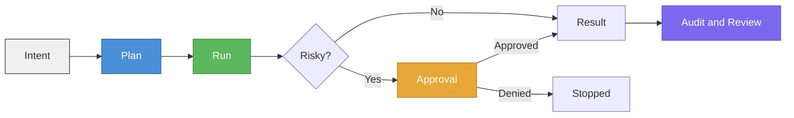
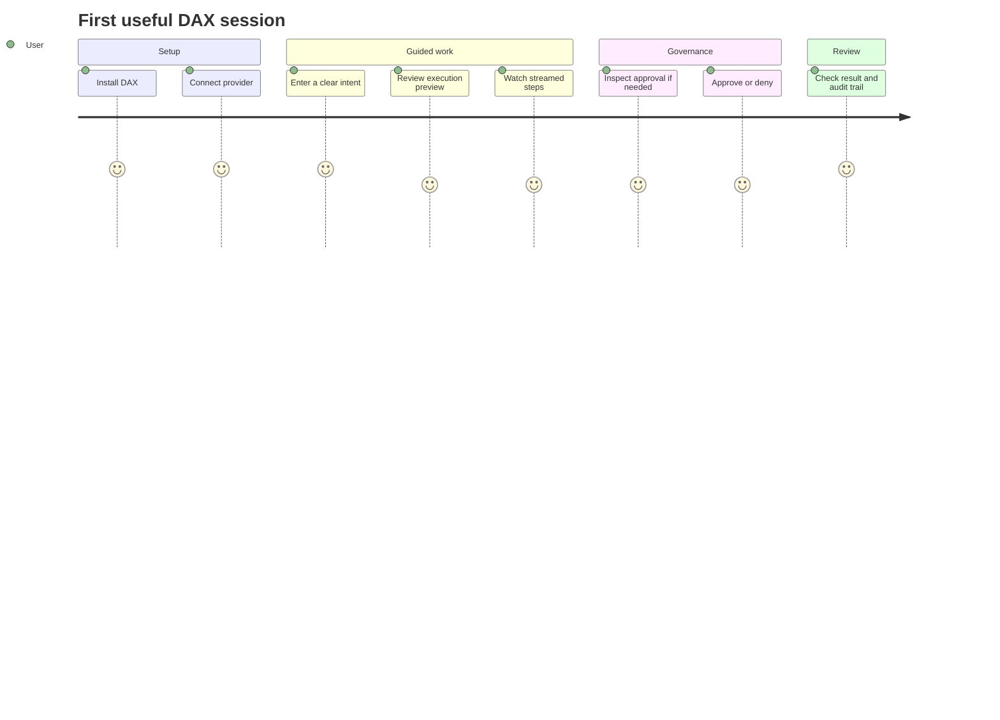

# DAX User Guide

This is the most practical guide to using DAX day to day.

If `What Is DAX?` explains the idea, this guide explains the lived experience:

1. Install DAX.
2. Connect a provider.
3. Give DAX a clear intent.
4. Watch the plan and execution stream.
5. Approve or deny risky actions.
6. Review the result, audit trail, and artifacts.

## Who This Guide Is For

This guide is for:

- builders using DAX for the first time
- developers who want the shortest path from install to useful work
- non-developers who want to understand what DAX is doing without reading architecture docs first

## The Short Version

DAX is a governed AI workstation.

You describe a goal in natural language. DAX turns that goal into an execution path. If it reaches a risky step, it pauses and asks. The work is recorded so you can inspect what happened later.

That is the core loop:

1. Intent
2. Plan
3. Run
4. Approval if needed
5. Result
6. Audit and review



## Step 1: Install DAX

Use the method that matches how you want to work:

- binary install: fastest for regular use
- Homebrew / WinGet: best if you prefer package managers
- developer install: best if you are working on DAX itself

Start here:

- [Quickstart](./QUICKSTART.md)
- [Provider Setup](./providers.md)

## Step 2: Connect a Model Provider

Most users should start with one provider only.

For Google / Gemini, the three visible options are:

- `Gemini API Key`
- `Gemini CLI Session Import`
- `Google OAuth Client Sign-In`

For most people:

- use `Gemini API Key` if you have a Google AI Studio API key
- use `Gemini CLI Session Import` if you already use Gemini through the `gemini` CLI
- use `Google OAuth Client Sign-In` if you want browser-based OAuth with a configured or user-managed Google client

Important:

- authentication is usually local to your machine and OS user
- if DAX already looks connected in another repository, that usually means you authenticated earlier on this machine
- other users still need to authenticate with their own accounts on their own machines

## Step 3: Start with a Small Intent

When you are learning DAX, do not start with "rewrite my whole system."

Start with something inspectable:

- `Explain this repository in simple words`
- `Review this project for obvious risks`
- `Find all TODO comments and group them by file`
- `Propose a safe cleanup plan for duplicated code in this folder`

Good first intents are:

- concrete
- bounded
- easy to verify
- not destructive

If you want help writing stronger intents, read the [Intent Guide](./INTENT_GUIDE.md).

## Step 4: Understand What DAX Shows You

When DAX starts working, pay attention to five things:

### 1. Execution preview

This is DAX's first framing layer. It tells you what kind of work it thinks you asked for.

### 2. Streamed steps

DAX shows work as it happens rather than hiding everything behind a final answer.

The stream is designed to stay readable during longer runs:

- live follow keeps the newest decision in view while the run is active
- if you intentionally scroll up, DAX should stop fighting you and let you inspect older context
- activity summaries emphasize `What happened`, `Result`, and `Next`

### 3. Tool use

DAX can search, read, inspect, fetch, edit, or execute depending on the situation and the active governance rules.

### 4. Approval pauses

If something is risky, DAX should stop and ask.

That is not friction by accident. It is part of the product.

### 5. Right pane state and memory

The right pane is your operational control surface:

- status and next operator action
- approvals and trust posture
- memory context (reflection + PM notes/rules)
- step tracker for active work and completed checkpoints

During live execution, smart pane-follow should usually keep the workstation surface in front of you. Use `memory` when you want grounded continuity instead of only current-turn activity.

## Display Mode + ELI12 + Persona (what each one does)

These are separate controls with different jobs:

| Control | Changes | Does not change |
| --- | --- | --- |
| Display mode (`operator`, `inspect`, `quiet`) | UI density and how much chrome is visible | permissions, approvals, policy |
| ELI12 toggle | explanation simplicity and wording | execution authority, tool access |
| Persona | presentation style labels/voice | policy, governance, capability gates |

`quiet` is for focus. It hides non-critical side chrome and keeps the stream readable.

## Step 5: Approvals Are a Feature, Not a Failure

DAX is built around RAO:

- `Run`
- `Audit`
- `Override`

This means some actions may require you to explicitly approve them before they continue.

Typical reasons for an approval:

- editing files
- running more sensitive shell commands
- touching areas protected by project rules
- moving from analysis into mutation

If DAX pauses:

1. read the reason
2. inspect the affected file, command, or proposed action
3. approve only if it matches your intent

## Step 6: Review the Outcome

After a run, look at:

- the final result
- any generated artifacts or diffs
- approvals that were triggered
- the audit summary

Helpful commands:

```bash
dax audit
dax artifacts
dax session
dax verify
```

## A Simple End-to-End Example

### Goal

You want DAX to analyze a repository and suggest a safe cleanup.

### Flow

1. Open the repository.
2. Run `dax`.
3. Enter: `Find duplicated utility code and propose a low-risk cleanup plan.`
4. DAX analyzes the repo.
5. DAX returns a plan.
6. You review the suggested cleanup.
7. If you ask DAX to apply a change, DAX may pause for approval.
8. You review the change before allowing it.
9. DAX completes the task and leaves a visible trail.

That is the expected user journey.



## What to Do If Something Feels Off

Run these first:

```bash
dax --version
dax auth doctor
dax models
```

For Gemini subscription issues:

```bash
gemini
dax auth login
```

If DAX says the Gemini subscription lane is busy:

- DAX is already retrying
- DAX is cooling down before the next request
- you may just need to wait
- if it keeps happening, switch lanes or try again later

## The Best Reading Path After This

1. [Intent Guide](./INTENT_GUIDE.md)
2. [Provider Setup](./providers.md)
3. [Runs, Approvals and Recovery](./RUNS_APPROVALS_AND_RECOVERY.md)
4. [Tool Reference and Risk Matrix](./TOOLS_AND_RISK_MATRIX.md)
5. [Project Memory Guide](./PROJECT_MEMORY.md)

For the more technical mental model, continue into [How DAX Works](../architecture/HOW_DAX_WORKS.md).

## Forking and Contributing

If DAX is interesting to you, fork it, try it on your own workflows, and open a PR when you find something worth improving.

The best contributions are usually:

- clearer docs
- better onboarding
- safer defaults
- sharper workflow behavior
- stronger governance and review surfaces

Start here:

- [Contributor Start Here](./contributor-start-here.md)
- [Builder's Note](../BUILDERS_NOTE.md)
