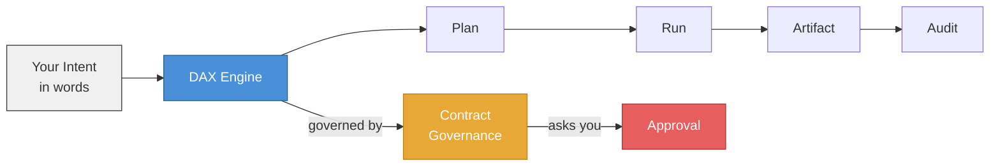
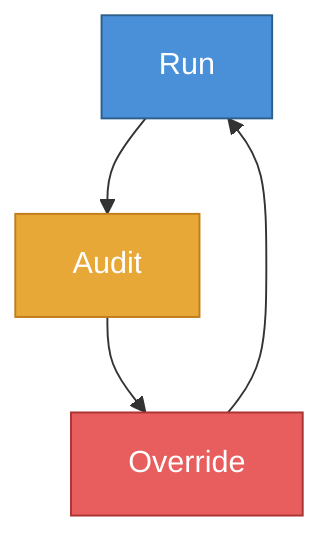
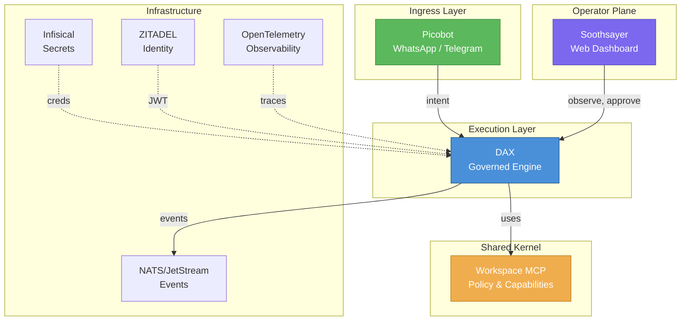

# What Is DAX?

DAX stands for **Deterministic AI eXecution**. It is a governed execution control plane for AI-assisted software development.

## What It Is

DAX is not a chatbot. It is an **execution engine** that takes a natural-language intent, builds a concrete execution plan, and carries it out — with human oversight at every step.

## What Problem It Solves

AI agents can generate code, run commands, and touch your filesystem. Without structure, that means:

- no visibility into what the agent actually did
- no audit trail for compliance
- no way to stop a runaway agent before it damages something
- no recovery when something goes wrong midway

DAX replaces free-running autonomy with **governed execution** — every action is recorded, every risky step requires approval, and the entire history can be replayed.

## One-Line Positioning

**DAX is the governed execution workstation for AI-driven software work, giving teams approvals, replayability, and audit-grade control instead of black-box agent behavior.**

## Who It Is For

| Role          | What DAX Gives You                                                                                      |
| ------------- | ------------------------------------------------------------------------------------------------------- |
| **Developer** | A terminal workstation that runs AI tasks with full transparency, approval gates, and replay            |
| **Tech lead** | A governance surface to review what the AI did, approve/deny risky actions, and audit execution history |
| **Team**      | A shared contract that makes AI behavior predictable and reviewable                                     |

## The RAO Model

DAX operates on a three-phase loop called **RAO**:

1. **Run** — The model proposes a technical action or plan.
2. **Audit** — Automated permission rules and safety gates evaluate the action.
3. **Override** — A human operator reviews, allows, or denies the decision.

This loop runs for every significant step. Nothing touches your codebase without going through it.

## Where DAX Sits

DAX is one piece of a larger ecosystem:

## What DAX Is Not

- **Not a coding assistant** — DAX does not chat about code. It executes governed workflows.
- **Not a black box** — Every step is recorded, auditable, and replayable.
- **Not autonomous** — Human approval gates are a core feature, not an optional add-on.

## How DAX Differs From Adjacent Tools

| Tool | Main mental model | What it does well | What DAX emphasizes instead |
| :--- | :--- | :--- | :--- |
| **Cursor** | AI coding inside the IDE | Rapid inline edits and assistance | Explicit approvals, governed execution, and run-level review |
| **Codex** | Agentic implementation runtime | Deep code generation and execution throughput | Structured run state, intervention semantics, and replayability |
| **Claude Code** | Terminal-native coding agent | Strong repo reasoning in a CLI workflow | Operator control, speculative previews, and audit-ready execution trails |
| **DAX** | Governed execution workstation | Trusted delivery flow for AI work in codebases | Delivery discipline over assistant convenience |

## Where DAX Is Heading

The product direction is becoming clearer:

- **`1.0.12`** hardens mode truthfulness, provider-neutral reflection, and real operator controls so the workstation feels more stable and less decorative in live use.
- **`1.1.x`** should deepen approvals and shared operator workflows.
- **`1.2.x`** should expand remote governance and multi-surface continuity.

## Next Steps

- **New to DAX?** Read [DAX In Simple Words](./DAX_IN_SIMPLE_WORDS.md) for analogies and a plain-language walkthrough.
- **Ready to try it?** Read [Quickstart](./QUICKSTART.md) to install and run your first workflow.
- **Want the product framing?** Read [Positioning](./POSITIONING.md) and [Roadmap](./ROADMAP.md).
- **Want to understand the internals?** Read [How DAX Works](../architecture/HOW_DAX_WORKS.md).
