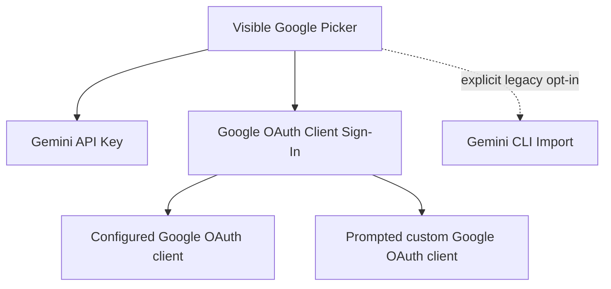

# Providers

DAX can be configured via project/global config and environment variables.

By default, provider authentication is local to the current machine and OS user. If you authenticate once on your laptop, DAX can usually reuse that authentication across repositories on the same machine. Other users still need to authenticate with their own accounts on their own machines.

## Common Provider Env Vars

- `OPENAI_API_KEY`
- `ANTHROPIC_API_KEY`
- `GEMINI_API_KEY` (or `GOOGLE_API_KEY`)
- `GOOGLE_CLOUD_PROJECT` (for Vertex providers)
- `GOOGLE_APPLICATION_CREDENTIALS` (optional explicit ADC path)
- `OLLAMA_BASE_URL` (default: `http://localhost:11434`)

## Google Provider Split (Important)

| Model Prefix | Auth Path                                                     |
| ------------ | ------------------------------------------------------------- |
| `google/*`   | Gemini API key or supported Google OAuth client sign-in |

Use diagnostics:

```bash
dax auth doctor
dax auth doctor google/gemini-2.5-flash
```

## Google Auth Lanes

DAX supports two default authentication lanes for the `google/*` provider.

In the current CLI and TUI UX, operators see:

- `Gemini API Key`
- `Google OAuth Client Sign-In`

Google [ended consumer Gemini CLI service](https://developers.google.com/gemini-code-assist/docs/deprecations/code-assist-individuals)
on June 18, 2026. Individual Google
AI subscription users should install and authenticate Antigravity CLI (`agy`)
and invoke it as a governed external worker:

```bash
dax worker run antigravity -- "<task>"
```

This is deliberately separate from `google/*` model-provider authentication.
AGY owns its local login; DAX does not import or persist AGY credentials. DAX
owns the disposable checkout, sandbox, exact-host proxy policy, observed diff,
verification, evidence, and approval.

The old `Gemini CLI Import (enterprise legacy)` lane is hidden by default. A
supported enterprise/Google Cloud deployment can expose it with:

```bash
export DAX_ENABLE_LEGACY_GEMINI_CLI_IMPORT=1
```

See Google's [Antigravity CLI installation](https://antigravity.google/docs/cli/install/)
and [headless mode](https://antigravity.google/docs/cli/headless/) documentation.

`Google OAuth Client Sign-In` is the browser-based lane. If `DAX_GOOGLE_CLI_CLIENT_ID` and `DAX_GOOGLE_CLI_CLIENT_SECRET` are configured, DAX can use them directly. Otherwise DAX will prompt for your own OAuth client credentials.

### Visible Lanes vs Underlying Implementation

The picker intentionally shows two default operator-facing choices even though the Gemini plugin may use more specific internal auth methods underneath.

| Visible lane | What DAX may use underneath | Best mental model |
| ------------ | --------------------------- | ----------------- |
| `Gemini API Key` | Google AI Studio API key | simplest direct API access |
| `Google OAuth Client Sign-In` | configured browser sign-in or user-managed Google OAuth client credentials | browser-based OAuth lane |
| `Gemini CLI Import (enterprise legacy)` | local `gemini` CLI import, opt-in only | supported enterprise/Google Cloud compatibility |



The internal method names are implementation details. They help DAX choose the right subscription path for the current machine, but they are not meant to be treated as separate public lanes.

## Anthropic Pro/Max Note

Anthropic recently changed how third-party apps consume Claude Pro/Max access.

For DAX operators, the practical implication is simple:

- DAX can still use the `Claude Pro/Max Sign-In` lane when your Anthropic session is healthy
- third-party usage may now draw from Anthropic "extra usage" credit instead of your normal plan bucket
- if the lane suddenly feels different from yesterday, the change may be billing or policy-side rather than a DAX auth bug

Builder note:

> Apparently the open ecosystem now comes with a velvet rope and a cover charge. A bleakly efficient business model, if not a particularly romantic one for open tooling.

Use diagnostics:

```bash
dax doctor auth anthropic
```

If DAX reports `auth_expired`, reconnect. If it reports `ready` but your run still fails, the next likely suspects are rate limits, model availability, or Anthropic-side policy pressure rather than local token expiry.

### 1. Gemini API Key (Default)

Fastest setup. Uses a free or pay-as-you-go API key from Google AI Studio.

### Legacy: Gemini CLI Import

This opt-in compatibility lane reuses a supported enterprise/Google Cloud
`gemini` CLI login. It is not a consumer Google AI subscription lane.

By default, DAX does not show or select it, even if old CLI credentials exist.

This is a local-user credential flow. DAX is not hard-coded to a particular builder account or bundled subscription.

If the imported enterprise session expires, DAX identifies it as legacy and
directs individual users to Antigravity or a Gemini API key.

If Google temporarily rate-limits this lane, DAX will wait and retry automatically. The TUI should say that the Gemini subscription lane is busy and show the retry countdown.

### 2. Google OAuth Client Sign-In

If you prefer browser-based sign-in or need stronger control, use the Google OAuth client lane:

1. Create an OAuth 2.0 Client ID at [Google Cloud Console](https://console.cloud.google.com/apis/credentials/oauthclient)
   - Application type: "Desktop app" or "Web application"
   - Note the Client ID and Client Secret

2. **In the TUI** (easiest):

   ```
   dax
   → Connect a model provider → Google
   → Google OAuth Client Sign-In
   → Enter your Client ID and Client Secret
   → Complete Google sign-in in browser
   ```

3. **Pre-configure credentials** (for repeated use):
   ```bash
   # Set environment variables before running dax
   export DAX_GOOGLE_CLI_CLIENT_ID="your-client-id"
   export DAX_GOOGLE_CLI_CLIENT_SECRET="your-client-secret"
   # Then run dax auth login and select "Google OAuth Client Sign-In"
   ```

### Troubleshooting

**Token refresh fails**

- Individual subscription users should check `agy` authentication and retry
  `dax worker run antigravity`.
- Supported enterprise legacy users may refresh `gemini` and reconnect after
  explicitly enabling the legacy lane.
- If you used `Google OAuth Client Sign-In`, re-run `dax auth login` and complete OAuth again.

**Scope errors**

- Make sure you're using `google/*` models (not `google-vertex/*`)
- Vertex uses different authentication (ADC credentials)

### Security Notes

- Your OAuth credentials are stored locally in `~/.local/share/dax/auth.json`
  (`Global.Path.data`, `auth/index.ts:47`, `cli/cmd/auth.ts:228`)
- Access and refresh tokens are stored securely
- Each user should use their own keys, AGY login, supported legacy CLI login,
  or OAuth client
- See [Security Policy](../../SECURITY.md) for more details
