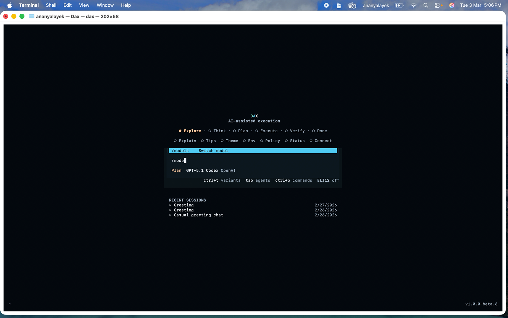
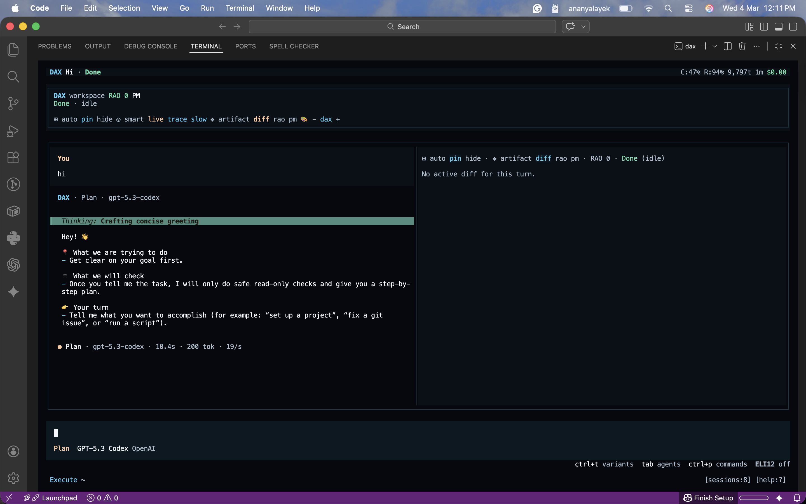
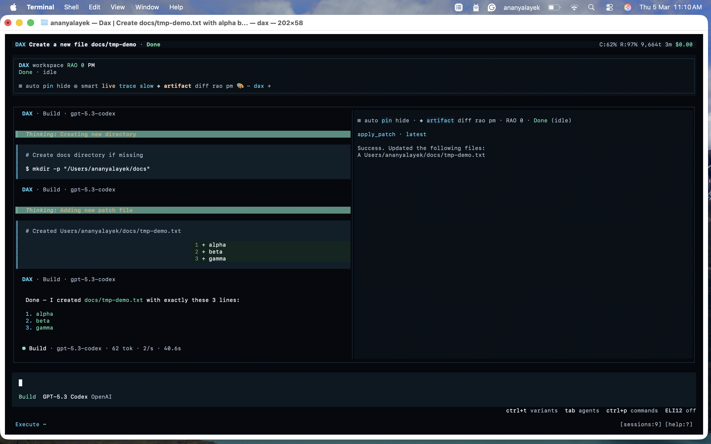

# DAX Start Here

This is the fastest path to first success with DAX.

## What You Need

- macOS, Linux, or Windows terminal
- Internet access for model providers
- A provider credential (OpenAI, Google, Anthropic, etc.)

## Install

Install the latest release:

```bash
curl -fsSL https://raw.githubusercontent.com/ShaileshRawat1403/dax-tui/main/script/install.sh | bash
```

Check install:

```bash
dax --version
```

## First Run

Start DAX:

```bash
dax
```

If you are developing inside this repo and want the repo-local config plus built-in skills:

```bash
bun run dax:local
```

Repo-local MCP remains opt-in. Enable a local MCP server only after its executable or remote auth flow is ready.

Use [examples/dax.workspace-mcp.jsonc](../../examples/dax.workspace-mcp.jsonc) as a starting point for a local `workspace_kernel` config instead of copying machine-specific paths from screenshots or old notes.

Then:

1. Choose provider/model.
2. Start with a safe intent, for example: `explore this repository and summarize the main execution flow`.
3. Review the workstation state and any approval pause before allowing risky actions.
4. If setup looks unhealthy, run `dax doctor`.
5. Watch the stream stages, result, and any proposed diffs.

## First Real Task

Try:

1. `dax plan "find all TODO comments and group by file, then propose a safe cleanup plan"`
2. Review the plan preview and readiness state.
3. `dax run "apply the first small cleanup and show the diff"`
4. `dax artifacts`
5. `dax audit`
6. `dax verify <session-id>`
7. `dax release check <session-id>`

This gives you a low-risk Plan -> Run -> Approvals -> Artifacts -> Audit -> Verify -> Release Check loop.

## Screenshots

### 1) Home screen



Capture:

- First screen after running `dax`
- Provider/model picker and prompt input both visible

### 2) Session screen + panes



Capture:

- One submitted prompt and response visible
- At least one right-side workstation surface visible such as `Workstation`, `Memory`, `Approvals`, `Diff`, or `Refine`
- Session review surfaces feel coherent and operator-facing

### 3) Diff review



Capture:

- One low-risk file edit
- Added and removed lines visible

## If Something Fails

Run:

```bash
dax --version
dax doctor
dax models
dax auth list
```

For Google-specific auth issues:

```bash
dax doctor auth
dax doctor auth google/gemini-2.5-flash
```

Next guide: see [docs/README.md](../README.md) for all available guides.
