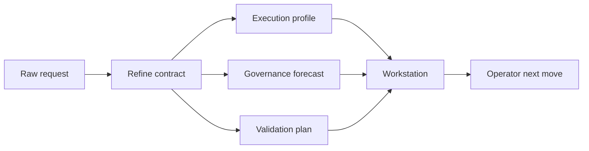

# DAX v1.0.10 — Refine Becomes an Operator Contract

**DAX v1.0.10** turns refine into a more meaningful operator-facing execution layer and tightens the workstation UI so live runs, review surfaces, and next moves feel more intentional.

---

## Why This Release Exists

`v1.0.9` made DAX more production-ready.

`v1.0.10` makes the product sharper at the exact point where an operator decides how to execute work. The goal is to make refine feel less like prompt cleanup and more like a governed execution contract that actually informs the live workstation.

## Highlights

### Refine Contract v2

Refine now carries more operational structure:

- execution profile
- contract delta
- staged validation plan
- governance hints
- repo impact

This makes refine much more useful for forecasting writes, approvals, validation, and risk before execution begins.

### Better Right-Pane Control Rail

The workstation pane now does more than display static cards.

- `Live lane` explains where the run is flowing now
- `Operator next move` gives the best practical action from the current state
- pane following can now favor `audit` or `changes` once the live run reaches verification or completion
- refine alignment or drift is now surfaced inside the workstation context

### Cleaner Finish State

When a run ends in a meaningful state, DAX now suggests operator-oriented next steps instead of stopping at a dead summary.

- explore runs suggest deeper inspection or turning findings into a plan
- plan runs suggest execution or tighter scope/risk refinement
- audit runs suggest reviewing findings, resolving them, or preparing signoff
- completed implementation runs suggest verifying evidence, reviewing changes, or packaging a handoff

### Restored DAX Visual Sharpness

This release also cleans up recent TUI rough edges:

- restored the sharper DAX-native theme feel
- removed the yellow emphasis drift
- fixed prompt/refine surfaces falling back to the terminal background
- reduced duplicate status noise on the home screen and workstation

## Validation

- `bun run --cwd packages/dax typecheck`
- `bun --cwd packages/dax test ./src/intent/interpret.test.ts ./src/dax/presentation/pane.test.ts ./src/dax/presentation/workstation.test.ts ./src/dax/presentation/session-surface.test.ts`
- `bun run test`
- `bun run --cwd packages/dax src/index.ts --help`

## Documentation

- [What Is DAX?](../product/WHAT_IS_DAX.md)
- [Roadmap](../product/ROADMAP.md)
- [CHANGELOG](../../CHANGELOG.md)
