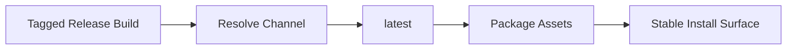

# DAX v1.0.7 — Release Channel Alignment

**DAX (Deterministic AI Execution)** v1.0.7 is a release-discipline patch. It does not introduce a new product model, but it makes the published artifact behave like a real stable release across packaging and channel selection.

---

## Why This Release Exists

The core issue was not end-user functionality inside the workstation. The issue was release identity.

Release-tagged builds should behave like stable `latest` builds when they move through packaging and publish flows. `v1.0.7` closes that gap so the release system tells the same story as the version number.

## Highlights

### Stable Release Channel Behavior

- Release builds are now treated as the `latest` channel during publish-time logic.
- Stable cuts no longer inherit preview-style channel behavior just because they came from release automation.

### Cleaner Release Surface

- Packaging and install surfaces for `v1.0.7` were aligned so the generated release assets match the public release intent more closely.

## Why It Matters

- Users get a more trustworthy release/install story.
- Maintainers get fewer surprises during stable publishing.
- The release pipeline now better reflects DAX's intended stable-channel behavior.

## Scope

This release is primarily about packaging and publish correctness. It is intentionally small and targeted.

## Documentation

- [Distribution Guide](../product/distribution.md)
- [Pre-release Guide](../product/prerelease.md)
- [CHANGELOG](../../CHANGELOG.md)
