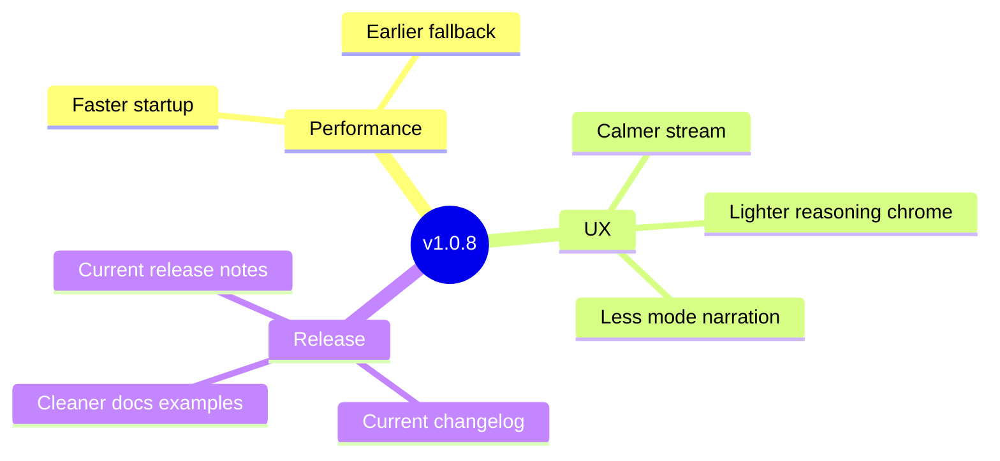

# DAX v1.0.8 — Faster Startup, Calmer Stream, Cleaner Release Story

**DAX (Deterministic AI Execution)** v1.0.8 improves the first-run feel of the workstation, restores more of the calmer stream behavior that operators preferred, and tightens the public release narrative around the current shipped state.

---

## What's New

### Faster First Useful Response

DAX now puts a tighter bound on intent-refinement latency so the workstation does not feel stuck before the real work begins.

- intent refinement now times out more aggressively instead of holding up the session
- the system falls back sooner when the structured refinement pass is not paying off
- startup feels more responsive in normal operator use

### Stream Feel Recovery

This release also continues the recent workstation polish work by recovering more of the calmer, evidence-forward stream style associated with `v1.0.4`.

- reasoning surfaces are less visually heavy
- the stream stays more focused on the work instead of the interface explaining itself
- plan-mode messaging is less repetitive and less mode-centric

### Better Release Coherence

The checked-in release story now catches up to the shipped version:

- `v1.0.7` and `v1.0.8` release notes are present in the repo
- the changelog reflects current release progression
- versioned examples in public docs are less brittle

## Fixed

- stabilized explore-session test cleanup
- reduced noisy provider-loader logging around optional loaders with no model entry
- improved release-surface continuity between version metadata, install examples, and checked-in notes

## Validation

- session startup path reviewed against the current intent refinement behavior
- release history checked against repo tags through `v1.0.8`
- public docs reviewed for stale hardcoded version examples and auth-lane explanation gaps

## Documentation

- [Quickstart](../product/QUICKSTART.md)
- [Providers Guide](../product/providers.md)
- [Distribution Guide](../product/distribution.md)
- [CHANGELOG](../../CHANGELOG.md)
