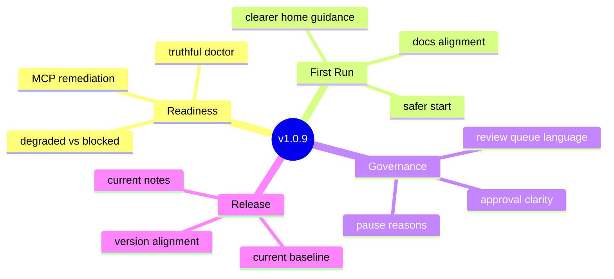

# DAX v1.0.9 — Production Readiness and Operator Clarity

**DAX (Deterministic AI Execution)** v1.0.9 turns the Phase 3 architecture into a more production-ready product surface. This release focuses on truthful readiness diagnostics, clearer first-run guidance, stronger governance language, and cleaner release coherence.

---

## Why This Release Exists

After the Phase 3 architectural evolution, DAX had become significantly more capable internally than its first-run and release surfaces suggested.

`v1.0.9` closes that gap. The goal is not another internal platform leap. The goal is to make the shipped product easier to trust, understand, and operate.

## Highlights

### Truthful Readiness Diagnostics

`dax doctor` now reports product readiness more honestly.

- readiness now distinguishes `ready`, `degraded`, and `blocked`
- optional MCP issues no longer look like fatal product failure by default
- broken local MCP paths surface the exact missing executable and configured command
- remediation guidance is more specific and operator-friendly

### Better First-Run Experience

The home screen now acts more like a real operator entrypoint.

- DAX explains safe first steps directly in the workstation
- first-run guidance points users toward Explore/Plan before risky edits
- the home surface now explicitly connects setup health, approvals, and next actions
- Quickstart and Start Here now match the current operator flow more closely

### Clearer Governance Language

Approvals and pauses now read more like a governed execution system and less like internal state labels.

- proposed changes use clearer review-oriented wording
- intervention titles are humanized
- the workstation now explains why a run is paused
- the review queue better explains what happens after allow, always allow, or deny

### Cleaner Release Surface

The public release story is aligned again.

- package metadata is now `1.0.9`
- installer examples use `v1.0.9`
- release-readiness guidance reflects the current doctor model
- checked-in release notes now match the actual shipped prep state

## Validation

- `bun run --cwd packages/dax typecheck`
- `bun --cwd packages/dax test ./src/doctor/index.test.ts`
- `bun --cwd packages/dax test ./src/server/run-projections.test.ts`
- `bun run --cwd packages/dax src/index.ts doctor --json`
- `bun run release:check`

## Documentation

- [Quickstart](../product/QUICKSTART.md)
- [Start Here](../product/start-here.md)
- [Release Readiness](../product/release-readiness.md)
- [Runs, Approvals and Recovery](../product/RUNS_APPROVALS_AND_RECOVERY.md)
- [CHANGELOG](../../CHANGELOG.md)
